# Development Guide

> How we build Halaqaty — Spec-Kit, Copilot, and the quality gates that protect production.

---

## Why Spec-Kit?

Traditional "vibe coding" — describing a feature in chat and accepting whatever Copilot generates — produces fast but fragile results. Field names are invented, edge cases are missed, and implementations drift from the product spec within days.

Halaqaty uses **[Spec-Kit](https://github.com/github/spec-kit)** (`v0.8.1`), an open-source spec-driven development toolkit by GitHub. The specification is the source of truth. Code is its generated output.

Before any production line is written:

1. A **specification** defines user stories, acceptance criteria, and requirements — based on our product docs.
2. A **plan** translates the spec into technical architecture, data models, and API contracts.
3. A **task list** breaks the plan into parallelizable implementation steps.
4. Copilot **implements** against the frozen spec and plan — not against a vague prompt.

Every PR is fully traceable: user story → contract → implementation → tests.

---

## Prerequisites

| Tool | Version | Install |
|---|---|---|
| `uv` | 0.11+ | See below |
| `specify-cli` | 0.8.1 | See below |
| VS Code | Latest | with **GitHub Copilot** extension |
| Git | 2.x+ | — |
| `golangci-lint` | v1.64.x | `go install github.com/golangci/golangci-lint/cmd/golangci-lint@v1.64.8` |
| `gitleaks` | latest | `go install github.com/zricethezav/gitleaks/v8@latest` |
| Node.js | 20+ | [nodejs.org](https://nodejs.org) — required for Spectral (API linting) |
| `spectral` + OAS ruleset | latest | `npm install -g @stoplight/spectral-cli` |

### Install uv (Windows)

```powershell
powershell -ExecutionPolicy ByPass -c "irm https://astral.sh/uv/install.ps1 | iex"
```

Then refresh your PATH in the current shell:

```powershell
$env:PATH = [System.Environment]::GetEnvironmentVariable('PATH', 'User') + ';' + [System.Environment]::GetEnvironmentVariable('PATH', 'Machine')
```

### Install specify-cli

```powershell
uv tool install specify-cli --from git+https://github.com/github/spec-kit.git@v0.8.1
```

### Verify

```powershell
specify version
specify check
```

---

## Slash Command Reference

All Spec-Kit commands are available in **VS Code Copilot Chat** and **GitHub Copilot Agent** using the `/` prefix:

| Command | Phase | Purpose |
|---|---|---|
| `/speckit.constitution` | Setup | Review or amend the governing constitution in `.specify/memory/constitution.md` |
| `/speckit.specify` | 1. Specify | Create a feature specification → `specs/NNN-feature-name/spec.md` + feature branch |
| `/speckit.clarify` | 2. Clarify | Ask 5-7 structured questions to resolve ambiguities in the spec |
| `/speckit.checklist` | 3. Checklist | Validate that spec is complete, clear, and consistent (unit test your English!) |
| `/speckit.plan` | 4. Plan | Generate `plan.md`, `data-model.md`, `contracts/`, `quickstart.md` from the spec |
| `/speckit.tasks` | 5. Tasks | Generate parallelizable `tasks.md` from the plan |
| `/speckit.analyze` | 6. Analyze | Cross-artifact consistency check before implementation |
| `/speckit.implement` | 7. Implement | Copilot executes all tasks — writes code, tests, and migrations |
| `/speckit.git.feature` | Branch | Create and name the feature branch per spec-kit convention |
| `/speckit.git.commit` | Commit | Structured commit with spec traceability |
| `/speckit.git.validate` | Validate | Validate git state before opening a PR |
| `/speckit.taskstoissues` | Sync | Push `tasks.md` entries to GitHub Issues |

---

## Feature Implementation Workflow

Every feature in Halaqaty follows this exact pipeline. **No shortcuts.**

### Complete 7-Phase Spec-Kit Workflow

```mermaid
flowchart LR
    S1["1️⃣ /speckit.specify\nProduct requirements\n→ spec.md"]
    S2["2️⃣ /speckit.clarify\nResolve ambiguities\n(5-7 questions)"]
    S3["3️⃣ /speckit.checklist\nValidate spec quality\n(completeness · clarity)"]
    S4["4️⃣ /speckit.plan\nArchitecture design\n→ plan.md · data-model.md\n→ contracts/"]
    S5["5️⃣ /speckit.tasks\nBreak into tasks\n→ tasks.md with P hints"]
    S6["6️⃣ /speckit.analyze\nCross-artifact\nconsistency check"]
    S7["7️⃣ /speckit.implement\nCode + tests\n+ migrations"]

    S1 --> S2 --> S3 --> S4 --> S5 --> S6 --> S7

    style S1 fill:#e8f4fd,stroke:#2196F3
    style S2 fill:#e8f4fd,stroke:#2196F3
    style S3 fill:#e8f4fd,stroke:#2196F3
    style S4 fill:#fff3e0,stroke:#FF9800
    style S5 fill:#fff3e0,stroke:#FF9800
    style S6 fill:#fff3e0,stroke:#FF9800
    style S7 fill:#e8f5e9,stroke:#4CAF50
```



> **No shortcuts.** Every feature must complete all 7 phases. All agent roles remain available throughout, but only the smallest relevant set is dispatched for each phase. See [`docs/engineering/collaboration/AGENT_COLLABORATION_GUIDE.md`](docs/engineering/collaboration/AGENT_COLLABORATION_GUIDE.md) for agent roles.

**Phase 1: Specify** → **Phase 2: Clarify** → **Phase 3: Checklist** → **Phase 4: Plan** → **Phase 5: Tasks** → **Phase 6: Analyze** → **Phase 7: Implement**

The Team Leader can consult any role throughout the cycle, but dispatches only agents whose specialty is material to the current phase. See [`docs/engineering/collaboration/AGENT_COLLABORATION_GUIDE.md`](docs/engineering/collaboration/AGENT_COLLABORATION_GUIDE.md) and [`docs/engineering/collaboration/AGENT_WORKFLOW_HARNESS.md`](docs/engineering/collaboration/AGENT_WORKFLOW_HARNESS.md).

### ✅ Pre-flight checklist

Before running any Spec-Kit command, verify:

```
[ ] Feature is listed in docs/management/product/FEATURES.md with status ≥ 🟡 Approved
[ ] All open questions for this feature are Decided in docs/management/product/MVP_DECISION_REGISTER.md
[ ] User journey for this feature is documented in docs/management/product/JOURNEY.md
[ ] You are on main branch, up to date (git pull)
```

---

### Step 1 — Create the spec

Open Copilot Chat in VS Code and run:

```
/speckit.specify [describe the feature in plain language, including doc references]
```

**Example:**
```
/speckit.specify
User authentication: email/password, Google Sign-In, and Apple Sign-In (required on iOS).
Flows: register, login, email verification, password reset, silent token refresh, logout.
See docs/management/product/FEATURES.md F-001 and docs/management/product/JOURNEY.md T-01 to T-04 for acceptance criteria.
```

This automatically:
- Creates branch `001-auth` (or next available number)
- Creates `specs/001-auth/spec.md` with structured user stories and acceptance criteria

**Review before continuing.** Check:
- User stories match `docs/management/product/FEATURES.md` acceptance criteria
- Edge cases from `docs/management/product/JOURNEY.md` are covered
- No `[NEEDS CLARIFICATION]` markers remain

---

### Step 2 — Clarify ambiguities *(optional but recommended)*

```
/speckit.clarify
```

Run this if the spec has open areas or if agents ask clarifying questions. Generates structured questions; answer them to close gaps before planning.

**When to run**: Whenever a relevant agent identifies a material ambiguity. The Team Leader consolidates cross-domain input into 5-7 non-duplicative questions total, then uses `/speckit.clarify` to resolve them formally.

---

### Step 3 — Validate spec quality *(optional but recommended)*

```
/speckit.checklist
```

Agents validate spec quality (not implementation) — checking completeness, clarity, consistency, coverage, and edge cases. Fix any gaps identified before proceeding to planning.

---

### Step 4 — Create the plan

```
/speckit.plan [describe tech choices and reference architecture docs]
```

**Example:**
```
/speckit.plan
Go backend, Echo v4. Firebase Auth JWT middleware. PostgreSQL users table via golang-migrate.
Flutter + Riverpod 2.x. See docs/engineering/architecture/ARCHITECTURE.md for full schema and endpoint definitions.
Constitution: .specify/memory/constitution.md
```

**Agents involved**:
- **Architect** designs system architecture and validates service boundaries
- **Golang Developer** designs backend APIs and database schema
- **Flutter Engineer** designs mobile state management and UX
- **Tech Lead** reviews for security and quality implications
- **Team Leader** documents dependencies and integration points

This creates:
- `specs/001-auth/plan.md` — implementation plan
- `specs/001-auth/data-model.md` — entity definitions and DB migrations
- `specs/001-auth/contracts/` — REST endpoints and WebSocket events
- `specs/001-auth/quickstart.md` — key validation scenarios

**Review the plan.** Check:
- DB migration matches `docs/engineering/architecture/ARCHITECTURE.md` schema exactly
- No new tables or columns invented without an ADR
- API endpoints match planned contract in `specs/001-auth/contracts/openapi.yaml`

---

### Step 5 — Generate task list

```
/speckit.tasks
```

Creates `specs/001-auth/tasks.md` with tasks annotated `[P]` for parallelizable work.

**Team Leader** sequences tasks respecting dependencies and ensuring:
- Golang Developer backend tasks are ready before Flutter Engineer needs APIs
- Architect schema/API design tasks precede implementation
- Tech Lead quality gates (review, security) are included in Definition of Done

Review it — confirm parallel tasks are genuinely independent.

---

### Step 6 — Cross-artifact analysis *(optional but recommended)*

```
/speckit.analyze
```

Checks consistency across spec, plan, data model, and contracts. Fix any inconsistencies before implementation:
- Are all requirements in spec addressed in plan?
- Are all plan decisions reflected in data model?
- Are contracts complete and consistent?
- Are there duplications or ambiguities?

**Gate**: Don't proceed to implementation until analysis passes.

---

### Step 7 — Implement

```
/speckit.implement
```

**Agents execute**:
- **Golang Developer** implements backend tasks
- **Flutter Engineer** implements mobile tasks
- **Tech Lead** reviews every code change (hard gate — no merge without approval)
- **Team Leader** unblocks any cross-team dependencies

Copilot generates all code, tests, and migration files per the task list. Monitor actively — intervene if the implementation deviates from the spec or constitution.

---

### Step 8 — Verify quality gates

All of these must be **green** before opening a PR:

| Gate | Command | Requirement |
|---|---|---|
| Go unit tests | `go test ./...` | 100% pass |
| Flutter tests | `flutter test` | 100% pass |
| Go integration tests | `go test -tags=integration ./...` | 100% pass |
| DB migration (fresh schema) | `make migrate-fresh` | No errors |
| Go linter | `golangci-lint run` | Zero violations |
| Dart analyzer | `flutter analyze` | Zero issues |
| Dart formatter | `dart format --set-exit-if-changed .` | No diff |
| Go formatter | `gofmt -l .` | Empty output |
| Secret scan | `gitleaks detect` | No findings |
| **OpenAPI spec lint** | `make api-lint` | Zero errors (Spectral OAS rules) |
| **Tech Lead Code Review** | Via GitHub PR | **Approved** (hard gate) |

> **Tip:** Run `make lint` to execute golangci-lint + flutter analyze + spectral lint + gitleaks in one command.

### About `make api-lint` (Spectral)

Spectral validates `docs/contracts/openapi.yaml` against the official OpenAPI Specification ruleset. It catches issues like unresolved `$ref` values, missing response schemas, duplicate `operationId` fields, and invalid security scheme definitions — before they become runtime bugs.

The linting rules are configured in **`.spectral.yaml`** at the repo root. Open that file for a full explanation of each setting, how to add custom rules, and when to modify it. Run `make api-lint` locally before pushing.

---

### Step 9 — Open PR

```
/speckit.git.commit
```

**PR title format:** `HLQ-NNN: feature name` (enforced by GitHub Actions)

**PR description must include:**
```
Implements: specs/NNN-feature-name/

## Summary
[brief description of what was implemented]

## Spec reference
- User stories: specs/NNN-feature-name/spec.md
- Plan: specs/NNN-feature-name/plan.md
- Tasks: specs/NNN-feature-name/tasks.md
```

PRs are **opened by Copilot**, reviewed and **merged by Karim only**. No merge without all green gates.

### Code Review Policy (Solo Founder)

Halaqaty is currently a solo-founder project with AI agent assistance. Review process:

**Standard flow:** Copilot AI agents open PRs following the Spec-Kit workflow. The Tech Lead agent performs automated review as the first layer. Karim reviews and merges all PRs as the sole human reviewer.

**Security-sensitive code — mandatory manual deep-review by Karim:**
- Authentication and JWT validation (`/auth/*` handlers, middleware)
- Authorization and RBAC (circle membership, role validation)
- Data deletion paths (account, circle, message deletion)
- Firebase Auth integration points
- File upload and MinIO access controls

**Accepted risk (solo context):** Logic errors in non-security code may not be caught before merge. Mitigated by: comprehensive automated tests, feature flags for rollback without deployment, and incremental release strategy (alpha → pilot → beta).

**Escalation:** When unsure about security implications — do not merge until sure. Consult the Tech Lead agent for security-specific review.

---

## 🤝 Agent Collaboration Model

Halaqaty development is powered by 5 specialized Copilot agents working autonomously and collaboratively:

### Engineering Agents

| Agent | Focus | Responsibilities |
|-------|-------|---|
| **Senior Golang Developer** | Backend services, APIs, concurrency, database | Design/implement REST APIs, database schema, WebSocket, LiveKit integration, security |
| **Senior Flutter Mobile Engineer** | Mobile UI, state management, RTL/Arabic support | Develop Flutter features, handle real-time UX, optimize performance, Arabic-first design |
| **Architect** | System design, service boundaries, technology choices | Define architecture, data model, API contracts, ensure scalability and consistency |
| **Tech Lead** | Code quality, security, performance, testing standards | Review all code changes (hard gate), enforce quality standards, mentor developers |
| **Team Leader** | Coordination, delivery tracking, Spec-Kit enforcement | Manage sprint planning, track dependencies, enforce Spec-Kit workflow, unblock teams |

### How Agents Collaborate

**Autonomous Communication** (no explicit prompting needed):
- Agents are aware of each other's roles and responsibilities
- They communicate asynchronously on integration points
- When ambiguous: relevant agents submit material questions and the Team Leader asks Karim **5-7 consolidated questions total** through `/speckit.clarify`
- When blocked: Agents escalate to Team Leader or relevant peer

**Throughout Spec-Kit Phases**:
1. **Specify**: Relevant agents review feasibility and constraints
2. **Clarify**: Relevant agents submit material questions; Team Leader consolidates them through `/speckit.clarify`
3. **Checklist**: Checklist agent consults a domain specialist only when needed
4. **Plan**: Team Leader selects Architect, Backend, Mobile, or other specialists only for affected domains
5. **Tasks**: Team Leader sequences with explicit dependencies
6. **Analyze**: Verify consistency before implementation
7. **Implement**: The assigned domain owner executes; other agents join only for dependencies or review

### Clarification Protocols

Relevant agents submit focused questions in their specialties. The Team Leader removes overlap and asks Karim 5-7 questions total through `/speckit.clarify`:

| Agent | Asks About | Example |
|-------|---|---|
| **Golang Dev** | API design, error codes, performance constraints | "What error code when student tries to recite twice?" |
| **Flutter Eng** | User flow, platform behavior, offline handling | "Should queue UI update in real-time?" |
| **Architect** | Scale requirements, reliability expectations, budget | "What's growth timeline to 500 users?" |
| **Tech Lead** | Quality/testing expectations, security standards | "What test coverage for WebSocket handlers?" |
| **Team Leader** | Release priorities, deadlines, scope boundaries | "What features are must-have for MVP?" |

**Key Principle**: `DO NOT GUESS` — Agents ask before investing time in wrong direction.

### Full Collaboration Guide

See [`docs/engineering/collaboration/AGENT_COLLABORATION_GUIDE.md`](docs/engineering/collaboration/AGENT_COLLABORATION_GUIDE.md) for:
- Detailed agent responsibilities
- Autonomous decision boundaries
- Escalation paths
- Communication patterns
- Integration point management

---

```
🔵 Proposed → 🟡 Approved → 🔧 In Progress → ✅ Shipped → 🔒 Frozen (post-MVP, behind flag)
```

| Status | Meaning | Gate |
|---|---|---|
| 🔵 Proposed | Idea or backlog item | — |
| 🟡 Approved | Spec-ready: all open questions resolved, journey documented | PM approval |
| 🔧 In Progress | `/speckit.specify` run, branch is open | Spec file exists |
| ✅ Shipped | PR merged, deployed | All quality gates green |
| 🔒 Frozen | Post-MVP, behind feature flag | Feature flag `false` in all envs |

---

## Branch Naming

Spec-Kit creates branches automatically via `/speckit.git.feature`. Format:

```
NNN-feature-name
```

Examples: `001-auth`, `002-circles`, `003-queue`, `004-chat`

---

## Project Structure (when code exists)

```
halaqaty/
├── .specify/                        ← Spec-Kit config and templates
│   └── memory/
│       └── constitution.md          ← THE governing document — read this first
├── .github/
│   ├── prompts/                     ← Spec-Kit slash command definitions
│   ├── agents/                      ← Spec-Kit + custom Copilot agents
│   └── workflows/                   ← GitHub Actions CI/CD
├── docs/                            ← Human-readable strategy & product docs
│   ├── management/                  ← Business & product strategy
│   │   ├── product/
│   │   │   ├── FEATURES.md          ← Feature status board (index)
│   │   │   ├── PRD.md               ← Product Requirements Document
│   │   │   ├── JOURNEY.md           ← Full user journey (teacher-first)
│   │   │   └── MVP_DECISION_REGISTER.md ← All frozen MVP decisions
│   │   ├── planning/
│   │   │   └── PROJECT_PLAN.md              ← Master project plan
│   │   ├── business/
│   │   └── arabic/
│   └── engineering/                 ← Technical architecture & deployment
│       ├── architecture/
│       │   ├── ARCHITECTURE.md      ← DB schema, API endpoints, security
│       │   └── adr/                 ← Architecture Decision Records
│       │       ├── README.md        ← ADR index
│       │       ├── ADR-001-modular-monolith.md
│       │       ├── ADR-002-go-framework.md
│       │       ├── ADR-003-flutter-state-management.md
│       │       ├── ADR-004-auth-boundary.md
│       │       ├── ADR-005-feature-flags.md
│       │       └── ADR-006-db-migrations.md
│       ├── deployment/
│       │   └── DEPLOYMENT.md        ← Deployment strategy
│       ├── development/
│       │   └── EXECUTION_PLAYBOOK.md ← Development execution workflow
│       └── collaboration/
│           └── AGENT_COLLABORATION_GUIDE.md
├── specs/                           ← Spec-Kit generated (per feature) — DO NOT EDIT MANUALLY
│   ├── 001-auth/
│   │   ├── spec.md
│   │   ├── plan.md
│   │   ├── data-model.md
│   │   ├── contracts/
│   │   ├── tasks.md
│   │   └── quickstart.md
│   └── ...
├── Makefile                         ← root: aggregate + cross-cutting targets (delegates to sub-Makefiles)
├── backend/                         ← Go service (backend owners)
│   ├── Makefile                     ← Go-only: test, lint, build, migrate-*
│   ├── cmd/
│   │   └── api/                     ← Go entry point (main.go)
│   ├── internal/                    ← Go domain packages
│   │   ├── auth/
│   │   ├── circles/
│   │   ├── chat/
│   │   ├── sessions/
│   │   ├── queue/
│   │   ├── progress/
│   │   ├── schedule/
│   │   ├── notifications/
│   │   └── shared/
│   ├── migrations/                  ← golang-migrate SQL files
│   │   ├── 000001_create_users.up.sql
│   │   ├── 000001_create_users.down.sql
│   │   └── ...
│   ├── go.mod
│   └── go.sum
├── mobile/                          ← Flutter application
│   ├── Makefile                     ← Flutter-only: test, analyze, build-apk, build-ios
│   ├── lib/
│   │   ├── features/                ← Feature-first Flutter structure
│   │   ├── core/
│   │   └── main.dart
│   └── pubspec.yaml
├── docker-compose.yml               ← MVP deployment
└── DEVELOPMENT.md                   ← This file
```

---

## Key Documents

| Document | Purpose |
|---|---|
| [`.specify/memory/constitution.md`](.specify/memory/constitution.md) | **Read first.** Governing principles for all code. Defines Spec-Kit workflow (all 7 phases), agent collaboration, and tech stack. |
| [`docs/engineering/collaboration/AGENT_COLLABORATION_GUIDE.md`](docs/engineering/collaboration/AGENT_COLLABORATION_GUIDE.md) | **Agent workflows.** How 5 engineering agents collaborate, clarification protocols, autonomous decision boundaries, escalation paths. |
| [`docs/management/product/FEATURES.md`](docs/management/product/FEATURES.md) | Feature status board — what's Approved vs Proposed |
| [`docs/engineering/architecture/ARCHITECTURE.md`](docs/engineering/architecture/ARCHITECTURE.md) | DB schema, API endpoints, security model |
| [`docs/management/product/JOURNEY.md`](docs/management/product/JOURNEY.md) | Screen-by-screen user journey with error/offline states |
| [`docs/management/product/MVP_DECISION_REGISTER.md`](docs/management/product/MVP_DECISION_REGISTER.md) | All frozen MVP rules — binding on implementation |
| [`docs/engineering/architecture/adr/`](docs/engineering/architecture/adr/) | Architecture Decision Records — why we chose each technology |
| [`docs/contracts/openapi.yaml`](docs/contracts/openapi.yaml) | REST API contract — source of truth for all endpoints |
| [`docs/contracts/ws_events.md`](docs/contracts/ws_events.md) | WebSocket event catalog — all real-time message types |
| [`.spectral.yaml`](.spectral.yaml) | OpenAPI linting config — rules enforced by `make api-lint` and CI; includes inline docs on how to add/modify rules |
| [`specs/NNN-feature/contracts/`](specs/NNN-feature/contracts/) | Per-feature OpenAPI + WS event overrides (generated by Spec-Kit) |

---

*Built with [Spec-Kit](https://github.com/github/spec-kit) · Powered by [GitHub Copilot](https://github.com/features/copilot)*
