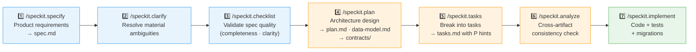

# Development Guide

> How we build Halaqaty — Spec-Kit, supported coding agents, and the quality gates that protect production.

---

## Why Spec-Kit?

Ad-hoc implementation can invent fields, miss edge cases, and drift from approved product scope.

Halaqaty uses **[Spec-Kit](https://github.com/github/spec-kit)** (`v0.8.1`) to define and track feature scope. Specs, plans, contracts, and tasks govern implementation; code is implemented and reviewed against them.

Before any production line is written:

1. A **specification** defines user stories, acceptance criteria, and requirements — based on our product docs.
2. A **plan** translates the spec into technical architecture, data models, and API contracts.
3. A **task list** breaks the plan into parallelizable implementation steps.
4. A supported coding agent implements against the approved artifacts and current task list.

Every PR is fully traceable: user story → contract → implementation → tests.

---

## Prerequisites

For the Firebase/LiveKit credentials, Docker images, and the verified T048
real-backend integration run, see the [Firebase and LiveKit testing setup
guide](docs/engineering/guides/firebase-livekit-testing-setup.md). Keep all
tokens, passwords, and Firebase Admin service-account files local and ignored.

| Tool | Version | Install |
|---|---|---|
| `uv` | 0.11+ | See below |
| `specify-cli` | 0.8.1 | See below |
| Coding agent | — | Codex, OpenCode, or GitHub Copilot with the required Spec-Kit integration |
| Git | 2.x+ | — |
| `golangci-lint` | v1.64.x | `go install github.com/golangci/golangci-lint/cmd/golangci-lint@v1.64.8` |
| `gitleaks` | latest | `go install github.com/zricethezav/gitleaks/v8@latest` |
| Node.js | 20+ | [nodejs.org](https://nodejs.org) — required for Spectral (API linting) |
| `spectral` + OAS ruleset | latest | `npm install -g @stoplight/spectral-cli` |

### Install uv (Windows)

```powershell
powershell -ExecutionPolicy ByPass -c "irm https://astral.sh/uv/install.ps1 | iex"
```

Then refresh your PATH in the current shell:

```powershell
$env:PATH = [System.Environment]::GetEnvironmentVariable('PATH', 'User') + ';' + [System.Environment]::GetEnvironmentVariable('PATH', 'Machine')
```

### Install specify-cli

```powershell
uv tool install specify-cli --from git+https://github.com/github/spec-kit.git@v0.8.1
```

### Verify

```powershell
specify version
specify check
```

---

## Slash Command Reference

Use the `/speckit.*` commands provided by the Spec-Kit integration in your coding environment. Command availability and invocation can vary by harness.

| Command | Phase | Purpose |
|---|---|---|
| `/speckit.constitution` | Setup | Review or amend the governing constitution in `.specify/memory/constitution.md` |
| `/speckit.specify` | 1. Specify | Create a feature specification → `specs/NNN-feature-name/spec.md` + feature branch |
| `/speckit.clarify` | 2. Clarify | Resolve material ambiguities in the spec |
| `/speckit.checklist` | 3. Checklist | Validate that spec is complete, clear, and consistent (unit test your English!) |
| `/speckit.plan` | 4. Plan | Generate `plan.md`, `data-model.md`, `contracts/`, `quickstart.md` from the spec |
| `/speckit.tasks` | 5. Tasks | Generate parallelizable `tasks.md` from the plan |
| `/speckit.analyze` | 6. Analyze | Cross-artifact consistency check before implementation |
| `/speckit.implement` | 7. Implement | Execute approved tasks with code, tests, and migrations |
| `/speckit.git.feature` | Branch | Create and name the feature branch per spec-kit convention |
| `/speckit.git.commit` | Commit | Structured commit with spec traceability |
| `/speckit.git.validate` | Validate | Validate git state before opening a PR |
| `/speckit.taskstoissues` | Sync | Push `tasks.md` entries to GitHub Issues |

---

## Feature Implementation Workflow

Every feature in Halaqaty follows this exact pipeline. **No shortcuts.**

### Required 7-Phase Spec-Kit Workflow


```mermaid
flowchart LR
    S1["1️⃣ /speckit.specify\nProduct requirements\n→ spec.md"]
    S2["2️⃣ /speckit.clarify\nResolve material ambiguities"]
    S3["3️⃣ /speckit.checklist\nValidate spec quality\n(completeness · clarity)"]
    S4["4️⃣ /speckit.plan\nArchitecture design\n→ plan.md · data-model.md\n→ contracts/"]
    S5["5️⃣ /speckit.tasks\nBreak into tasks\n→ tasks.md with P hints"]
    S6["6️⃣ /speckit.analyze\nCross-artifact\nconsistency check"]
    S7["7️⃣ /speckit.implement\nCode + tests\n+ migrations"]

    S1 --> S2 --> S3 --> S4 --> S5 --> S6 --> S7

    style S1 fill:#e8f4fd,stroke:#2196F3
    style S2 fill:#e8f4fd,stroke:#2196F3
    style S3 fill:#e8f4fd,stroke:#2196F3
    style S4 fill:#fff3e0,stroke:#FF9800
    style S5 fill:#fff3e0,stroke:#FF9800
    style S6 fill:#fff3e0,stroke:#FF9800
    style S7 fill:#e8f5e9,stroke:#4CAF50
```

Every feature completes all seven phases. Use only the agents needed for the current work. The [agent workflow harness](docs/engineering/collaboration/AGENT_WORKFLOW_HARNESS.md) defines how Spec-Kit, implementation skills, role agents, and quality guards fit together.

**Phase 1: Specify** → **Phase 2: Clarify** → **Phase 3: Checklist** → **Phase 4: Plan** → **Phase 5: Tasks** → **Phase 6: Analyze** → **Phase 7: Implement**

See the [agent workflow harness](docs/engineering/collaboration/AGENT_WORKFLOW_HARNESS.md) for role selection, ownership, and review rules.

### ✅ Pre-flight checklist

Before running any Spec-Kit command, verify:

```
[ ] Feature is listed in docs/management/product/FEATURES.md with status ≥ 🟡 Approved
[ ] All open questions for this feature are Decided in docs/management/product/MVP_DECISION_REGISTER.md
[ ] User journey for this feature is documented in docs/management/product/JOURNEY.md
[ ] You are on the intended feature branch/worktree and its base is current
```

---

### Step 1 — Create the spec

In your supported Spec-Kit environment, run:

```
/speckit.specify [describe the feature in plain language, including doc references]
```

**Example:**
```
/speckit.specify
User authentication: email/password, Google Sign-In, and Apple Sign-In (required on iOS).
Flows: register, login, email verification, password reset, silent token refresh, logout.
See docs/management/product/FEATURES.md F-001 and docs/management/product/JOURNEY.md T-01 to T-04 for acceptance criteria.
```

This creates or updates the feature's `spec.md` with user stories and acceptance criteria. Create or select its `NNN-feature-name` branch with `/speckit.git.feature` when needed.

**Review before continuing.** Check:
- User stories match `docs/management/product/FEATURES.md` acceptance criteria
- Edge cases from `docs/management/product/JOURNEY.md` are covered
- No `[NEEDS CLARIFICATION]` markers remain

---

### Step 2 — Clarify ambiguities

```
/speckit.clarify
```

Resolve material ambiguities before planning. If requirements are already clear, record that outcome and continue.

Consolidate related questions; ask only what changes scope, contracts, security, architecture, or user-visible behavior.

---

### Step 3 — Validate spec quality

```
/speckit.checklist
```

Agents validate spec quality (not implementation) — checking completeness, clarity, consistency, coverage, and edge cases. Fix any gaps identified before proceeding to planning.

---

### Step 4 — Create the plan

```
/speckit.plan [describe tech choices and reference architecture docs]
```

**Example:**
```
/speckit.plan
Use the approved backend and mobile stack. Follow `docs/engineering/architecture/ARCHITECTURE.md`, relevant ADRs, and the canonical contracts; do not add schema or API scope without approval.
Constitution: .specify/memory/constitution.md
```

This creates:
- `specs/001-auth/plan.md` — implementation plan
- `specs/001-auth/data-model.md` — entity definitions and DB migrations
- `specs/001-auth/contracts/` — REST endpoints and WebSocket events
- `specs/001-auth/quickstart.md` — key validation scenarios

**Review the plan.** Check:
- DB migration matches `docs/engineering/architecture/ARCHITECTURE.md` schema exactly
- No new tables or columns invented without an ADR
- API endpoints match planned contract in `specs/001-auth/contracts/openapi.yaml`

---

### Step 5 — Generate task list

```
/speckit.tasks
```

Creates `specs/001-auth/tasks.md` with tasks annotated `[P]` for parallelizable work.

Review it — confirm parallel tasks are genuinely independent.

---

### Step 6 — Cross-artifact analysis

```
/speckit.analyze
```

Checks consistency across spec, plan, data model, and contracts. Fix any inconsistencies before implementation:
- Are all requirements in spec addressed in plan?
- Are all plan decisions reflected in data model?
- Are contracts complete and consistent?
- Are there duplications or ambiguities?

**Gate**: Don't proceed to implementation until analysis passes.

---

### Step 7 — Implement

```
/speckit.implement
```

The assigned domain owner implements tasks against the approved artifacts. Apply test-first development, focused review, and the required project quality guards; see the [agent workflow harness](docs/engineering/collaboration/AGENT_WORKFLOW_HARNESS.md).

---

### Step 8 — Verify quality gates

All of these must be **green** before opening a PR:

| Gate | Command | Requirement |
|---|---|---|
| Go unit tests | `go test -short ./...` (in `backend/`) | All pass |
| Go contract tests | `make test-contract` (in `backend/`) | All contract tests pass |
| Flutter tests | `flutter test test` (in `mobile/`) | All pass |
| Go integration tests | `go test -tags=integration ./...` (in `backend/`, with `DATABASE_URL`) | All pass |
| Flutter integration | `flutter test integration_test/` (in `mobile/`, with device and backend configured) | All pass |
| Go coverage floor | `make coverage` (from `backend/`) | ≥80% aggregate over `backend/internal/` |
| Go linter | `golangci-lint run ./...` (in `backend/`) | Zero violations |
| Dart analyzer | `flutter analyze` (in `mobile/`) | Zero issues |
| Dart formatter | `dart format --set-exit-if-changed .` (in `mobile/`) | No diff |
| Go formatter | `gofmt -l .` (in `backend/`) | Empty output |
| Secret scan | `make secrets` (from repo root) | No findings |
| **OpenAPI spec lint** | `make api-lint` | Zero errors (Spectral OAS rules) |
| **Tech Lead Code Review** | Via GitHub PR | **Approved** (hard gate) |

> These commands require the documented local services/devices where noted. Report unavailable or skipped checks explicitly; an unrun gate is not a pass. See [AGENTS.md](AGENTS.md) for the complete gate matrix and [local environment runbooks](docs/engineering/development/LOCAL_ENVIRONMENT_RUNBOOKS.md) for environment-specific setup.

### About `make api-lint` (Spectral)

Spectral validates `docs/contracts/openapi.yaml` against the official OpenAPI Specification ruleset. It catches issues like unresolved `$ref` values, missing response schemas, duplicate `operationId` fields, and invalid security scheme definitions — before they become runtime bugs.

The linting rules are configured in **`.spectral.yaml`** at the repo root. Open that file for a full explanation of each setting, how to add custom rules, and when to modify it. Run `make api-lint` locally before pushing.

---

### Step 9 — Commit and open PR

```
/speckit.git.commit
```

**PR title format:** `HLQ-NNN: feature name` (enforced by GitHub Actions)

**PR description must include:**
```
Implements: specs/NNN-feature-name/

## Summary
[brief description of what was implemented]

## Spec reference
- User stories: specs/NNN-feature-name/spec.md
- Plan: specs/NNN-feature-name/plan.md
- Tasks: specs/NNN-feature-name/tasks.md
```

Follow the [Code Review Policy](#code-review-policy) and [AGENTS.md](AGENTS.md) for applicable gates and required reviews.

### Code Review Policy

All PRs require the applicable quality gates and Tech Lead review. Karim's manual deep-review is mandatory for auth, RBAC, deletion, Firebase Auth, and MinIO/upload changes. See [AGENTS.md](AGENTS.md) for current gate and review requirements.

---

## 🤝 Agent Collaboration

Use the [agent workflow harness](docs/engineering/collaboration/AGENT_WORKFLOW_HARNESS.md) as the authoritative guide to supported harnesses, role selection, clarification, delegation, project guards, and review. The [agent collaboration guide](docs/engineering/collaboration/AGENT_COLLABORATION_GUIDE.md) contains role-specific detail.

---

Current feature status and its meanings are maintained in [FEATURES.md](docs/management/product/FEATURES.md).

---

## Branch Naming

Spec-Kit creates branches automatically via `/speckit.git.feature`. Format:

```
NNN-feature-name
```

Examples: `001-auth`, `002-circles`, `003-queue`, `004-chat`

---

## Project Structure

See the [repository overview](README.md) for the current top-level structure and [docs/README.md](docs/README.md) for the documentation map.

---

## Key Documents

| Document | Purpose |
|---|---|
| [`.specify/memory/constitution.md`](.specify/memory/constitution.md) | **Read first.** Governing principles for all code. Defines Spec-Kit workflow (all 7 phases), agent collaboration, and tech stack. |
| [`docs/engineering/collaboration/AGENT_WORKFLOW_HARNESS.md`](docs/engineering/collaboration/AGENT_WORKFLOW_HARNESS.md) | **Agent workflow.** How Spec-Kit, implementation skills, role agents, and project quality guards fit together. |
| [`docs/engineering/collaboration/AGENT_COLLABORATION_GUIDE.md`](docs/engineering/collaboration/AGENT_COLLABORATION_GUIDE.md) | Role-specific responsibilities and collaboration guidance. |
| [`docs/management/product/FEATURES.md`](docs/management/product/FEATURES.md) | Feature status board — what's Approved vs Proposed |
| [`docs/engineering/architecture/ARCHITECTURE.md`](docs/engineering/architecture/ARCHITECTURE.md) | DB schema, API endpoints, security model |
| [`docs/management/product/JOURNEY.md`](docs/management/product/JOURNEY.md) | Screen-by-screen user journey with error/offline states |
| [`docs/management/product/MVP_DECISION_REGISTER.md`](docs/management/product/MVP_DECISION_REGISTER.md) | All frozen MVP rules — binding on implementation |
| [`docs/engineering/architecture/adr/`](docs/engineering/architecture/adr/) | Architecture Decision Records — why we chose each technology |
| [`docs/contracts/openapi.yaml`](docs/contracts/openapi.yaml) | REST API contract — source of truth for all endpoints |
| [`docs/contracts/ws_events.md`](docs/contracts/ws_events.md) | WebSocket event catalog — all real-time message types |
| [`.spectral.yaml`](.spectral.yaml) | OpenAPI linting config — rules enforced by `make api-lint` and CI; includes inline docs on how to add/modify rules |
| [`specs/NNN-feature/contracts/`](specs/NNN-feature/contracts/) | Per-feature OpenAPI + WS event overrides (generated by Spec-Kit) |

---

*Built with [Spec-Kit](https://github.com/github/spec-kit) · Implemented with supported coding agents*
