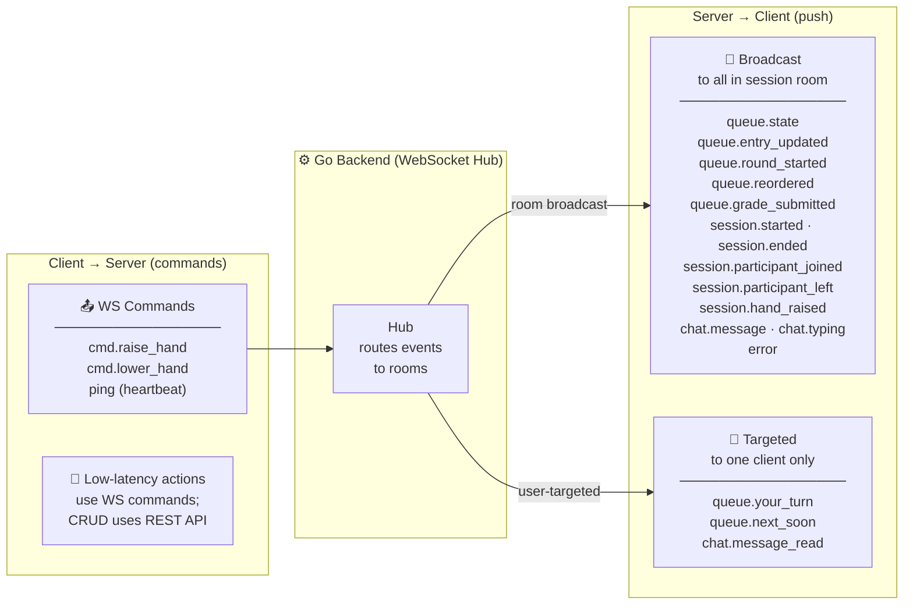

# WebSocket Events Catalogue

Real-time communication in Halaqaty uses a persistent WebSocket connection per authenticated session. This document defines all events exchanged between the Flutter client and the Go backend.

## Connection

### Handshake

1. Client fetches a short-lived WS token via `POST /api/v1/sessions/{id}/ws-token` (valid for 60 seconds).
2. Client connects: `wss://api.halaqaty.app/ws?token=<ws_token>`
3. Server validates the token, upgrades the connection, and adds the client to its relevant rooms (circle rooms the user is a member of).

### Heartbeat

- Client sends `{"type": "ping"}` every 30 seconds.
- Server responds `{"type": "pong", "server_time": "<ISO8601>"}`.
- Connection is considered dead after 3 missed pong responses; client reconnects automatically.

---

## Event Envelope

All events follow this envelope schema:

```json
{
  "type": "event.name",
  "payload": { ... },
  "timestamp": "2024-01-15T10:30:00Z",
  "request_id": "optional-client-correlation-id"
}
```

## Event Flow Overview



---

### `queue.state` (Server → Client)

Sent when a client joins a session or when the queue is reset. Full queue snapshot.

```json
{
  "type": "queue.state",
  "payload": {
    "session_id": "uuid",
    "round_number": 1,
    "status": "active",
    "entries": [
      {
        "queue_entry_id": "uuid",
        "student_id": "uuid",
        "student_name": "Ahmad Al-Rashid",
        "position": 1,
        "status": "reciting",
        "surah_id": 2,
        "from_ayah": 1,
        "to_ayah": 10
      }
    ]
  }
}
```

**Queue entry statuses:** `waiting` | `reciting` | `completed` | `skipped` | `opted_out`

> **Cross-reference:** `queue_entry_id` in WebSocket events corresponds to `QueueEntry.id` in the REST API (`GET /sessions/{id}/queue`). The WS events use the longer name for clarity in event payloads; the REST schema uses `id` following standard JSON API conventions.

---

### `queue.entry_updated` (Server → Client)

Broadcast to all session participants when a single queue entry changes status.

```json
{
  "type": "queue.entry_updated",
  "payload": {
    "session_id": "uuid",
    "queue_entry_id": "uuid",
    "student_id": "uuid",
    "old_status": "waiting",
    "new_status": "reciting",
    "position": 1,
    "grade": null
  }
}
```

---

### `queue.your_turn` (Server → Client, targeted)

Sent only to the student whose turn it is. Triggers the "Your turn!" notification.

```json
{
  "type": "queue.your_turn",
  "payload": {
    "session_id": "uuid",
    "queue_entry_id": "uuid",
    "surah_id": 2,
    "surah_name": "Al-Baqarah",
    "from_ayah": 1,
    "to_ayah": 10
  }
}
```

---

### `queue.next_soon` (Server → Client, targeted)

Sent to the student who is next in queue (position 2) to give them time to prepare.

```json
{
  "type": "queue.next_soon",
  "payload": {
    "session_id": "uuid",
    "position": 2,
    "estimated_wait_seconds": null
  }
}
```

---

### `queue.reordered` (Server → Client)

Broadcast when the teacher manually reorders the queue.

```json
{
  "type": "queue.reordered",
  "payload": {
    "session_id": "uuid",
    "new_order": ["uuid1", "uuid2", "uuid3"]
  }
}
```

---

### `queue.round_started` (Server → Client)

Broadcast when the teacher starts a new recitation round.

```json
{
  "type": "queue.round_started",
  "payload": {
    "session_id": "uuid",
    "round_number": 2,
    "surah_id": 3,
    "surah_name": "Al-Imran",
    "from_ayah": 1,
    "to_ayah": 20,
    "grading_required": true
  }
}
```

---

### `queue.grade_submitted` (Server → Client)

Broadcast to teacher/supervisors when a grade is recorded for a completed turn.

```json
{
  "type": "queue.grade_submitted",
  "payload": {
    "session_id": "uuid",
    "queue_entry_id": "uuid",
    "student_id": "uuid",
    "grade": "excellent",
    "notes": "Masha'Allah, strong tajweed",
    "graded_by": "uuid"
  }
}
```

**Grade values:** `excellent` | `good` | `needs_improvement` | `repeat`

---

## Session Events

### `session.started` (Server → Client)

Broadcast to all circle members when a session goes live.

```json
{
  "type": "session.started",
  "payload": {
    "session_id": "uuid",
    "circle_id": "uuid",
    "livekit_url": "wss://livekit.halaqaty.app",
    "livekit_token": "eyJ..."
  }
}
```

---

### `session.ended` (Server → Client)

Broadcast to all session participants when the teacher ends the session.

```json
{
  "type": "session.ended",
  "payload": {
    "session_id": "uuid",
    "ended_by": "uuid",
    "duration_seconds": 3600,
    "total_turns_completed": 12
  }
}
```

---

### `session.participant_joined` (Server → Client)

Broadcast to all session participants.

```json
{
  "type": "session.participant_joined",
  "payload": {
    "session_id": "uuid",
    "user_id": "uuid",
    "display_name": "Fatima Al-Zahra",
    "role": "student"
  }
}
```

---

### `session.participant_left` (Server → Client)

```json
{
  "type": "session.participant_left",
  "payload": {
    "session_id": "uuid",
    "user_id": "uuid"
  }
}
```

---

### `session.hand_raised` (Server → Client)

```json
{
  "type": "session.hand_raised",
  "payload": {
    "session_id": "uuid",
    "student_id": "uuid",
    "student_name": "Omar Abdullah"
  }
}
```

---

## Chat Events

### `chat.message` (Server → Client)

Delivered to all circle members who are online. Offline members receive FCM push.

```json
{
  "type": "chat.message",
  "payload": {
    "message_id": "uuid",
    "circle_id": "uuid",
    "sender_id": "uuid",
    "sender_name": "Sheikh Abdullah",
    "message_type": "text",
    "content": "السلام عليكم",
    "reply_to_id": null,
    "sent_at": "2024-01-15T10:30:00Z"
  }
}
```

**Message types:** `text` | `voice` | `image` | `file`

---

### `chat.message_read` (Server → Client)

Sent to the message sender when the recipient reads a message.

```json
{
  "type": "chat.message_read",
  "payload": {
    "message_id": "uuid",
    "read_by": "uuid",
    "read_at": "2024-01-15T10:31:00Z"
  }
}
```

---

### `chat.typing` (Server → Client)

```json
{
  "type": "chat.typing",
  "payload": {
    "circle_id": "uuid",
    "user_id": "uuid",
    "display_name": "Ali Hassan",
    "is_typing": true
  }
}
```

---

## Client → Server Commands

Clients can send commands over the WebSocket as an alternative to REST for low-latency actions.

### `cmd.raise_hand`

```json
{
  "type": "cmd.raise_hand",
  "payload": {
    "session_id": "uuid"
  }
}
```

### `cmd.lower_hand`

```json
{
  "type": "cmd.lower_hand",
  "payload": {
    "session_id": "uuid"
  }
}
```

---

## Error Events

### `error` (Server → Client)

Sent when the server cannot process a client command.

```json
{
  "type": "error",
  "payload": {
    "code": "QUEUE_NOT_ACTIVE",
    "message": "No active round in this session",
    "request_id": "optional-correlation-id"
  }
}
```

**Error codes:** `UNAUTHORIZED` | `QUEUE_NOT_ACTIVE` | `INVALID_PAYLOAD` | `RATE_LIMITED` | `SESSION_ENDED`

---

## Event Delivery Guarantees

| Event | Delivery | Deduplication |
|-------|----------|---------------|
| `queue.*` | At-least-once (broadcast to all in room) | Client ignores duplicate `queue_entry_id` + `new_status` pairs |
| `session.*` | At-least-once | Client ignores duplicate `session_id` + `type` pairs within 5s |
| `chat.message` | At-least-once | Client deduplicates by `message_id` |
| `queue.your_turn` | At-least-once + FCM backup | Client shows notification once per `queue_entry_id` |

> **Source of truth:** PostgreSQL is always the source of truth. On reconnection, clients re-fetch state via REST (`GET /api/v1/sessions/{id}/queue`) rather than relying solely on WebSocket events.
