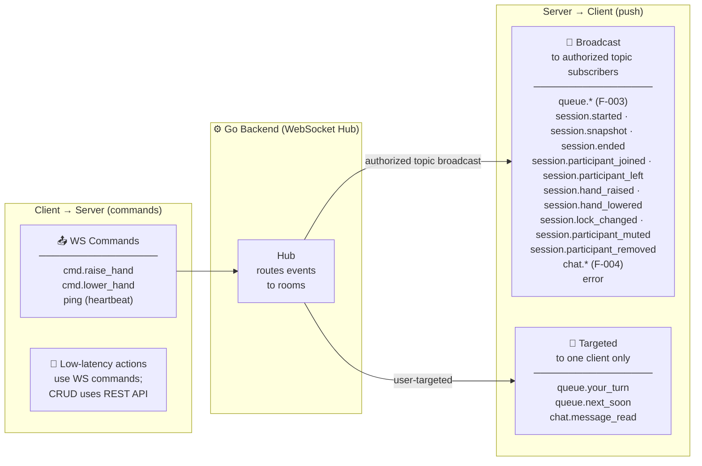

# WebSocket Events Catalogue

Real-time communication in Halaqaty uses a persistent WebSocket connection per authenticated session. This document defines all events exchanged between the Flutter client and the Go backend.

## Connection

### Handshake

1. Client fetches a short-lived realtime ticket via `POST /api/v1/realtime/tickets` (valid for 60 seconds).
2. Client connects: `wss://api.halaqaty.app/ws?token=<ticket>`
3. Server validates the ticket, revalidates the user's authorized circle topics, upgrades the connection, and adds a session topic only after a successful authorized join.

The generic ticket establishes shared transport only. It never authorizes a media-room join; the caller must still use the authenticated session start/join REST operation to obtain their own media connection. Circle chat may reuse circle topics without an active session.

### Heartbeat

- Client sends `{"type": "ping"}` every 30 seconds.
- Server responds `{"type": "pong", "server_time": "<ISO8601>"}`.
- Connection is considered dead after 3 missed pong responses; client reconnects automatically.

---

## Event Envelope

All events follow this envelope schema:

```json
{
  "type": "event.name",
  "payload": { ... },
  "timestamp": "2024-01-15T10:30:00Z",
  "request_id": "optional-client-correlation-id"
}
```

## Event Flow Overview



---

### Queue Event Envelope and Recovery

Every `queue.*` event uses the existing authorized F-005 session topic and
includes a stable `event_id` plus UTC `occurred_at`. Round-scoped payloads include
`session_id`, `round_id`, and the committed monotonic round `version`; the
session-scoped policy event carries its policy version instead. Delivery
is at-least-once: clients deduplicate by `event_id`, ignore stale versions, and
re-fetch `GET /sessions/{id}/queue` after reconnect, an unknown event, or a
version gap. Events never carry a media credential, endpoint, room reference,
provider identifier, or URL containing media material.

### `queue.state` (Server → Client)

Sent after an authorized session-topic subscription or explicit reconciliation.
The payload matches the visibility-filtered REST `QueueState` shape, except entry
IDs use `queue_entry_id` for event-catalog clarity.

```json
{
  "type": "queue.state",
  "event_id": "uuid",
  "occurred_at": "2026-08-23T10:15:30Z",
  "payload": {
    "session_id": "uuid",
    "round_id": "uuid",
    "round_number": 1,
    "round_type": "revision",
    "lifecycle": "active",
    "surah_id": 2,
    "from_ayah": 1,
    "to_ayah": 10,
    "grading_required": true,
    "selected_entry_id": "uuid",
    "version": 4,
    "policy": {
      "population": "present_at_activation",
      "unfinished_finalization": "mark_unfinished_skipped",
      "opt_out": "approval_required",
      "grade_visibility": "managers_and_student",
      "grade_correction": "audited_any_time",
      "version": 1
    },
    "preorder": [
      { "student_id": "uuid", "student_name": "Ahmad Al-Rashid", "position": 1 }
    ],
    "entries": [
      {
        "queue_entry_id": "uuid",
        "student_id": "uuid",
        "student_name": "Ahmad Al-Rashid",
        "position": 1,
        "status": "reciting",
        "version": 2
      }
    ]
  }
}
```

**Queue entry statuses:** `waiting` | `reciting` | `completed` | `skipped` | `opted_out`

> **Cross-reference:** `queue_entry_id` in WebSocket events corresponds to `QueueEntry.id` in the REST API (`GET /sessions/{id}/queue`). The WS events use the longer name for clarity in event payloads; the REST schema uses `id` following standard JSON API conventions.

---

### `queue.entry_updated` (Server → Client)

Broadcast to all session participants when a single queue entry changes status.

```json
{
  "type": "queue.entry_updated",
  "event_id": "uuid",
  "occurred_at": "2026-08-23T10:16:00Z",
  "payload": {
    "session_id": "uuid",
    "round_id": "uuid",
    "queue_entry_id": "uuid",
    "student_id": "uuid",
    "old_status": "waiting",
    "new_status": "reciting",
    "position": 1,
    "entry_version": 2,
    "version": 5
  }
}
```

Grade/note are absent from this broadcast. Authorized recipients obtain their
visibility-filtered projection from `queue.state` or REST.

---

### `queue.your_turn` (Server → Client, targeted)

Sent only to the student whose turn it is. Triggers the "Your turn!" notification.

```json
{
  "type": "queue.your_turn",
  "event_id": "uuid",
  "occurred_at": "2026-08-23T10:20:00Z",
  "payload": {
    "session_id": "uuid",
    "round_id": "uuid",
    "queue_entry_id": "uuid",
    "round_type": "revision",
    "surah_id": 2,
    "surah_name": "Al-Baqarah",
    "from_ayah": 1,
    "to_ayah": 10,
    "version": 6
  }
}
```

---

### `queue.next_soon` (Server → Client, targeted)

Sent to the student who is next in queue (position 2) to give them time to prepare.

```json
{
  "type": "queue.next_soon",
  "event_id": "uuid",
  "occurred_at": "2026-08-23T10:20:00Z",
  "payload": {
    "session_id": "uuid",
    "round_id": "uuid",
    "queue_entry_id": "uuid",
    "position": 2,
    "version": 6
  }
}
```

---

### `queue.reordered` (Server → Client)

Broadcast after a manager changes the durable order, by either control:

- `preorder_students` — full-list replace of pre-set candidates (round `prepared` only);
- `entry_move` — one `waiting` entry repositioned in the active round (permitted while another entry recites; the `reciting` entry is never moved).

`ordered_ids` is the resulting complete order (candidate student IDs for
`preorder_students`; the full round entry order for `entry_move`).

```json
{
  "type": "queue.reordered",
  "event_id": "uuid",
  "occurred_at": "2026-08-23T10:17:00Z",
  "payload": {
    "session_id": "uuid",
    "round_id": "uuid",
    "order_kind": "entry_move",
    "ordered_ids": ["uuid1", "uuid2"],
    "version": 3
  }
}
```

---

### `queue.round_started` (Server → Client)

Emitted when a prepared round activates. Activation is automatic in round-number
order: the first prepared round activates when the session is live and no round
is active, and each subsequent prepared round activates when the previous round
finalizes, including after reset. Queue activation does not change participant
audio permission. No manager activate action exists.

```json
{
  "type": "queue.round_started",
  "event_id": "uuid",
  "occurred_at": "2026-08-23T10:15:30Z",
  "payload": {
    "session_id": "uuid",
    "round_id": "uuid",
    "round_number": 2,
    "round_type": "revision",
    "lifecycle": "active",
    "surah_id": 3,
    "surah_name": "Al-Imran",
    "from_ayah": 1,
    "to_ayah": 20,
    "grading_required": true,
    "version": 1
  }
}
```

---

### `queue.grade_submitted` (Server → Client, visibility-filtered)

Sent only to recipients permitted by the current grade/note visibility policy
when a completed turn is graded or corrected.

```json
{
  "type": "queue.grade_submitted",
  "event_id": "uuid",
  "occurred_at": "2026-08-23T10:30:00Z",
  "payload": {
    "session_id": "uuid",
    "round_id": "uuid",
    "queue_entry_id": "uuid",
    "student_id": "uuid",
    "grade": "excellent",
    "notes": "Masha'Allah, strong tajweed",
    "entry_version": 3,
    "version": 8
  }
}
```

**Grade values:** `excellent` | `good` | `acceptable` | `needs_review` | `repeat`

Actor attribution remains in redacted audit telemetry; delivery infrastructure
must not log notes.

---

### `queue.advanced` (Server → Client)

Broadcast after a manager durably selects the next waiting entry. Selection does
not itself change the entry to `reciting`.

```json
{
  "type": "queue.advanced",
  "event_id": "uuid",
  "occurred_at": "2026-08-23T10:18:00Z",
  "payload": {
    "session_id": "uuid",
    "round_id": "uuid",
    "selected_entry_id": "uuid",
    "version": 9
  }
}
```

---

### `queue.round_finalized` (Server → Client)

```json
{
  "type": "queue.round_finalized",
  "event_id": "uuid",
  "occurred_at": "2026-08-23T11:00:00Z",
  "payload": {
    "session_id": "uuid",
    "round_id": "uuid",
    "round_number": 1,
    "reason": "reset",
    "version": 12
  }
}
```

`reason` is `reset` or `session_ended`. Session-end convergence finalizes the
active round and every never-activated prepared round (permanently inert,
retained); each emits this event with reason `session_ended`. Finalization never
means the F-005 session end waited for queue cleanup.

---

### `queue.policy_changed` (Server → Client)

Broadcast after a prospective closed-policy change. The payload contains the
current `population`, `unfinished_finalization`, `opt_out`, `grade_visibility`,
`grade_correction`, and policy `version`; it contains no prior values or notes.

---

### `queue.opt_out_requested` (Server → Client, targeted)

Sent only to current teachers/supervisors when an `approval_required` request is
pending. Payload: `session_id`, `round_id`, `request_id`, `queue_entry_id`,
`student_id`, and round `version`. Auto-approved opt-outs do not emit this event.

---

## Session Events

### `session.started` (Server → Client)

Broadcast to authorized circle subscribers when a session goes live. This event
announces availability; receiving it does not authorize or automatically join the
recipient to the media room.

Connection credentials are never included in broadcast events. Each participant
obtains an identity-specific `media_connection` through the authorized session
start or join REST operation after current identity, device session, membership,
session state, lock, removal, and capacity checks.

```json
{
  "type": "session.started",
  "payload": {
    "session_id": "uuid",
    "circle_id": "uuid"
  }
}
```

---

### `session.ended` (Server → Client)

Broadcast to all session participants when a moderator or an automatic lifecycle limit ends the session.

```json
{
  "type": "session.ended",
  "payload": {
    "session_id": "uuid",
    "ended_by": null,
    "end_reason": "duration_limit",
    "duration_seconds": 3600
  }
}
```

---

### `session.snapshot` (Server → Client)

Sent to a successfully joined participant after join or reconnect. It contains
authoritative session and current-presence/hand state only; it never contains a
media credential or provider room reference.

```json
{
  "type": "session.snapshot",
  "timestamp": "2024-01-15T10:30:00Z",
  "payload": {
    "session": { "id": "uuid", "status": "active", "is_locked": false },
    "participants": []
  }
}
```

---

### `session.participant_joined` (Server → Client)

Broadcast to all session participants.

```json
{
  "type": "session.participant_joined",
  "payload": {
    "session_id": "uuid",
    "user_id": "uuid",
    "display_name": "Fatima Al-Zahra",
    "role": "student"
  }
}
```

---

### `session.participant_left` (Server → Client)

```json
{
  "type": "session.participant_left",
  "payload": {
    "session_id": "uuid",
    "user_id": "uuid"
  }
}
```

---

### `session.hand_raised` (Server → Client)

```json
{
  "type": "session.hand_raised",
  "payload": {
    "session_id": "uuid",
    "participant_id": "uuid",
    "participant_name": "Omar Abdullah"
  }
}
```

### `session.hand_lowered` (Server → Client)

```json
{
  "type": "session.hand_lowered",
  "payload": {
    "session_id": "uuid",
    "participant_id": "uuid",
    "participant_name": "Omar Abdullah",
    "hand_raised_at": null
  }
}
```

### `session.lock_changed` (Server → Client)

```json
{
  "type": "session.lock_changed",
  "payload": { "session_id": "uuid", "locked": true, "changed_by": "uuid" }
}
```

### `session.participant_muted` / `session.participant_removed` (Server → Client)

```json
{
  "type": "session.participant_muted",
  "payload": { "session_id": "uuid", "user_id": "uuid", "changed_by": "uuid" }
}
```

---

## Chat Events

### `chat.message` (Server → Client)

Delivered to all circle members who are online. Offline members receive FCM push.

```json
{
  "type": "chat.message",
  "payload": {
    "message_id": "uuid",
    "circle_id": "uuid",
    "sender_id": "uuid",
    "sender_name": "Sheikh Abdullah",
    "message_type": "text",
    "content": "السلام عليكم",
    "reply_to_id": null,
    "sent_at": "2024-01-15T10:30:00Z"
  }
}
```

**Message types:** `text` | `voice` | `image` | `file`

---

### `chat.message_read` (Server → Client)

Sent to the message sender when the recipient reads a message.

```json
{
  "type": "chat.message_read",
  "payload": {
    "message_id": "uuid",
    "read_by": "uuid",
    "read_at": "2024-01-15T10:31:00Z"
  }
}
```

---

### `chat.typing` (Server → Client)

```json
{
  "type": "chat.typing",
  "payload": {
    "circle_id": "uuid",
    "user_id": "uuid",
    "display_name": "Ali Hassan",
    "is_typing": true
  }
}
```

---

## Client → Server Commands

Clients can send hand commands over the WebSocket as an alternative to REST for low-latency actions. Any active session participant may send them.

### `cmd.raise_hand`

```json
{
  "type": "cmd.raise_hand",
  "payload": {
    "session_id": "uuid"
  }
}
```

### `cmd.lower_hand`

```json
{
  "type": "cmd.lower_hand",
  "payload": {
    "session_id": "uuid"
  }
}
```

---

## Error Events

### `error` (Server → Client)

Sent when the server cannot process a client command.

```json
{
  "type": "error",
  "payload": {
    "code": "QUEUE_NOT_ACTIVE",
    "message": "No active round in this session",
    "request_id": "optional-correlation-id"
  }
}
```

**Error codes:** `UNAUTHORIZED` | `QUEUE_NOT_ACTIVE` | `INVALID_PAYLOAD` | `RATE_LIMITED` | `SESSION_ENDED`

---

## Event Delivery Guarantees

| Event | Delivery | Deduplication |
|-------|----------|---------------|
| `queue.*` | At-least-once (authorized broadcast or targeted delivery) | Client deduplicates by `event_id`, ignores stale versions, and re-fetches on gaps |
| `session.*` | At-least-once | Client deduplicates by event ID when supplied, otherwise by `session_id`, type, affected user, and monotonic state version |
| `chat.message` | At-least-once | Client deduplicates by `message_id` |
| `queue.your_turn` | At-least-once; F-008 may add FCM projection | Client shows once per `event_id` and re-fetches authoritative state |

> **Source of truth:** PostgreSQL is always the source of truth. On F-005 reconnection, clients obtain a fresh realtime ticket and re-fetch the authorized session participant snapshot; F-003 queue clients re-fetch `GET /sessions/{id}/queue` rather than relying solely on WebSocket events.
