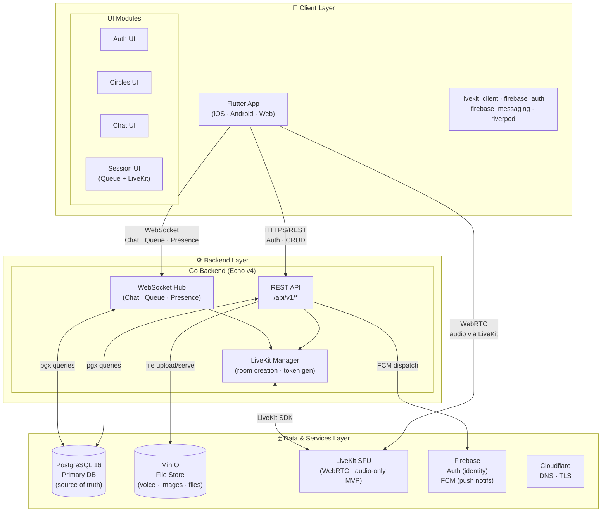
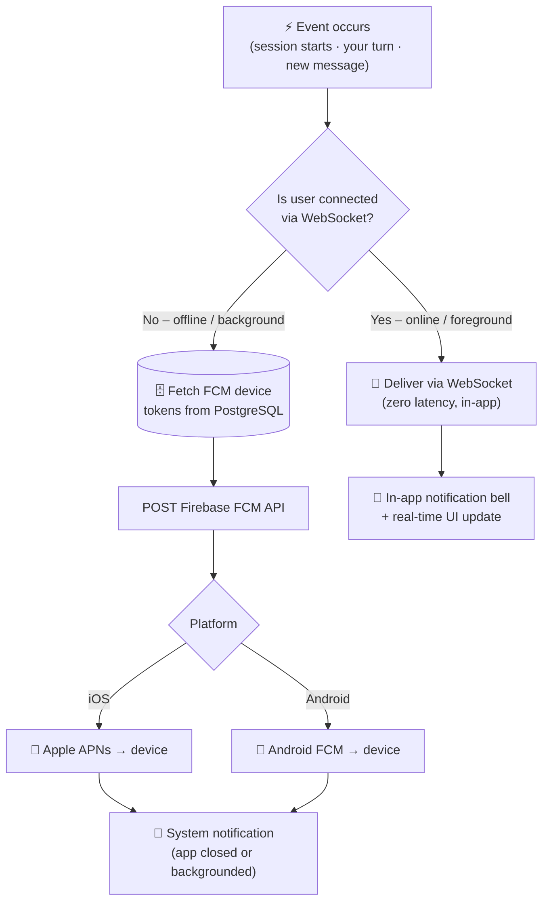
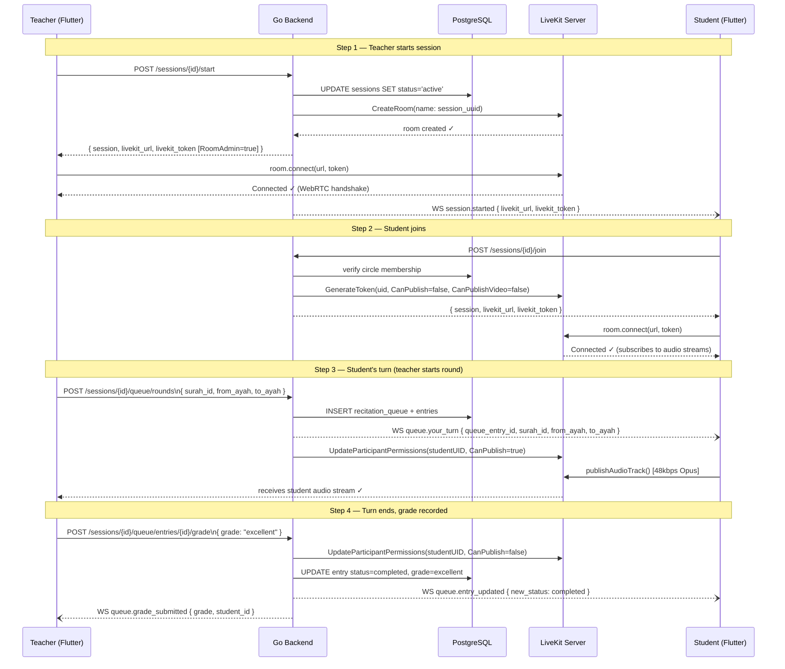
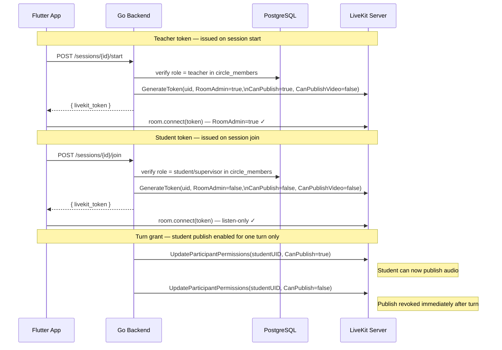
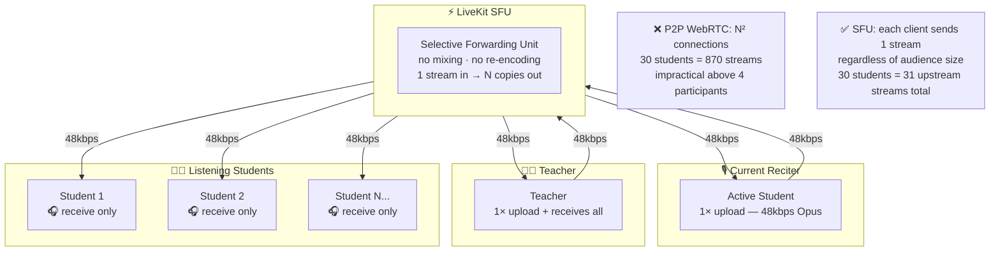
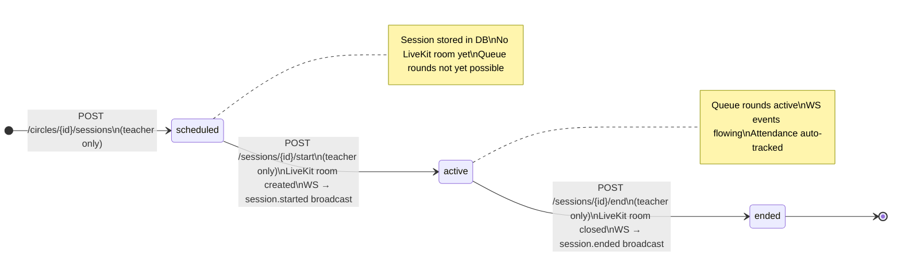

# Halaqaty — Technical Architecture

> **Version:** 1.0 | **Status:** Planning Phase | **Last Updated:** 2026

**Related Documents:** [product/PRD.md](../../management/product/PRD.md) · [planning/PROJECT_PLAN.md](../../management/planning/PROJECT_PLAN.md) · [deployment/DEPLOYMENT.md](../deployment/DEPLOYMENT.md) · [README.md (ADR index)](./README.md) · [../../../DEVELOPMENT.md](../../../DEVELOPMENT.md) · [collaboration/AGENT_COLLABORATION_GUIDE.md](../collaboration/AGENT_COLLABORATION_GUIDE.md)

> **Key architectural decisions** (framework choice, state management, auth boundary, migrations) are documented as ADRs in [`./adr/`](./adr/) — see [`./README.md`](./README.md) for the live index.

---

## Table of Contents

1. [System Overview Diagram](#1-system-overview-diagram)
2. [Communication Protocols](#2-communication-protocols)
3. [LiveKit + Flutter Integration](#3-livekit--flutter-integration)
4. [Database Schema](#4-database-schema)
5. [API Endpoint Planning](#5-api-endpoint-planning)
6. [Security Considerations](#6-security-considerations)

---

## 1. System Overview Diagram



---

## 2. Communication Protocols

### 2.1 HTTPS / REST API

**Used for:** All standard CRUD operations, authentication, file uploads, configuration.

- Stateless request-response model
- JWT authentication header: `Authorization: Bearer <token>`
- JSON request/response bodies
- Standard HTTP status codes
- Versioned: `/api/v1/...`

**When to use REST (not WebSocket):**
- Creating/reading/updating/deleting resources (circles, sessions, users, progress records)
- File upload (photos, voice notes — multipart to presigned MinIO URL)
- Authentication token exchange
- Long-form data retrieval (history, reports)

### 2.2 WebSocket (Real-time)

**Used for:** Real-time communication that requires low latency and server-push capability.

**WebSocket connection lifecycle:**

```mermaid
sequenceDiagram
    participant C as Flutter Client
    participant API as Go REST API
    participant WS as WebSocket Hub
    participant DB as PostgreSQL

    C->>API: POST /sessions/{id}/ws-token
    API->>DB: verify session membership
    DB-->>API: membership confirmed
    API-->>C: { token, expires_at } (60s TTL)

    C->>WS: WSS wss://api.halaqaty.app/ws?token=<ws_token>
    WS->>DB: validate token, load circle memberships
    DB-->>WS: user circles
    WS-->>C: connection upgraded ✓
    Note over WS: client registered in Hub rooms<br/>(circle IDs, session IDs)

    loop Every 30 seconds
        C->>WS: { "type": "ping" }
        WS-->>C: { "type": "pong", "server_time": "..." }
    end

    Note over C,WS: On disconnect → Hub removes client<br/>Client reconnects + re-fetches state via REST

### 2.5 Real-Time Data Flow — End-to-End Example

How a teacher starting a new queue round propagates from REST call to every connected client:

```mermaid
sequenceDiagram
        participant T as Teacher (Flutter)
        participant API as Go REST API
        participant DB as PostgreSQL
        participant Hub as WebSocket Hub
        participant S as Student (Flutter)
        participant O as Other Students

        rect rgb(230,245,255)
            Note over T,O: Teacher starts a new recitation round
            T->>+API: POST /sessions/{id}/queue/rounds\n{ surah_id:2, from_ayah:1, to_ayah:10 }
            API->>DB: INSERT recitation_queue (round 1, surah_id=2)
            API->>DB: INSERT recitation_queue_entries for all members
            DB-->>API: queue_id, entries[]
            API->>Hub: emit queue.round_started to session room
            Hub-->>T: queue.round_started { round_number:1, surah_id:2, ... }
            Hub-->>O: queue.round_started { round_number:1, surah_id:2, ... }
            Hub-->>S: queue.round_started { round_number:1, surah_id:2, ... }
            API-->>-T: 201 QueueState { entries: [...] }
        end

        rect rgb(230,255,230)
            Note over T,O: First student's turn begins
            API->>Hub: emit queue.your_turn to Student S (targeted)
            Hub-->>S: queue.your_turn { queue_entry_id, surah_id:2, from_ayah:1, to_ayah:10 }
            API->>Hub: emit queue.entry_updated to all (broadcast)
            Hub-->>T: queue.entry_updated { new_status: reciting, student_id: S }
            Hub-->>O: queue.entry_updated { new_status: reciting, student_id: S }
        end

        rect rgb(255,245,230)
            Note over T,O: Student raises hand (WS command — no REST round-trip)
            S->>Hub: cmd.raise_hand { session_id }
            Hub->>DB: log raise_hand event
            Hub-->>T: session.hand_raised { student_id, student_name }
            Hub-->>O: session.hand_raised { student_id, student_name }
        end
```
```

**Event Envelope (all events):**
```json
{
  "type": "event.name",
  "payload": { "...": "..." },
  "timestamp": "2024-01-15T10:30:00Z",
  "request_id": "optional-client-correlation-id"
}
```

**Server → Client event types:**

| Type | Description |
|------|-------------|
| `queue.state` | Full queue snapshot — sent on join or queue reset |
| `queue.entry_updated` | Single queue entry status change |
| `queue.your_turn` | Targeted: notifies the student whose turn it is |
| `queue.next_soon` | Targeted: notifies the student who is next (position 2) |
| `queue.reordered` | Teacher manually reordered the queue |
| `queue.round_started` | New recitation round started |
| `queue.grade_submitted` | Grade recorded for a completed turn (teacher/supervisor only) |
| `session.started` | Session went live; includes `livekit_url` and `livekit_token` |
| `session.ended` | Session ended by teacher |
| `session.participant_joined` | A participant joined the session |
| `session.participant_left` | A participant left the session |
| `session.hand_raised` | A student raised their hand |
| `chat.message` | New circle message delivered |
| `chat.message_read` | Recipient read a message (sent to sender) |
| `chat.typing` | Typing indicator |
| `error` | Server could not process a client command |

**Client → Server command types:**

| Type | Description |
|------|-------------|
| `cmd.raise_hand` | Student raises hand in session |
| `cmd.lower_hand` | Student lowers hand in session |
| `ping` | Heartbeat (every 30 s) |

> **Source of truth for all event schemas and payloads:** [`docs/contracts/ws_events.md`](../../contracts/ws_events.md)

> **Reconnection:** on reconnect, clients re-fetch state via REST (`GET /api/v1/sessions/{id}/queue`, etc.) rather than relying solely on buffered WebSocket events.

### 2.3 WebRTC via LiveKit

**Used for:** Audio streaming in live sessions for MVP (video remains post-MVP behind feature flag).

- LiveKit is a Selective Forwarding Unit (SFU) — it receives each participant's stream and forwards it to all others, without mixing
- This is more scalable than peer-to-peer WebRTC (which doesn't scale beyond ~4 participants)
- Flutter client uses `livekit_client` package (official LiveKit Flutter SDK)
- Go backend uses `livekit-server-sdk-go` for room management and token generation

**Quality levels supported:**
- Audio: Opus codec, 48–64 kbps, mono (sufficient for voice)
- Video (post-MVP feature flag): VP8/VP9, simulcast (low/medium/high), adaptive bitrate

### 2.4 Firebase Cloud Messaging (FCM)

**Used for:** Push notifications when the app is in the background or completely closed.

**Flow — WS online vs FCM offline decision:**



---

## 3. LiveKit + Flutter Integration

### 3.1 Complete Integration Flow



### 3.2 LiveKit Token Security Flow

The Go backend is the **sole token issuer** — the Flutter client never calls LiveKit APIs directly (Constitution §IV.1). Tokens encode the minimum permission set for each role.



> **Security invariant:** `CanPublishVideo` is **always** `false` in MVP. The token generation function enforces this unconditionally — no code path can produce a video-enabled token until `FEATURE_VIDEO_ENABLED=true` and an ADR approves the change.

### 3.3 Go Backend — Token Generation Code Pattern

```go
// Using github.com/livekit/server-sdk-go

func generateLiveKitToken(
    apiKey, apiSecret, roomName, identity, name string,
    isTeacher bool,
    canPublishAudio bool, // for students: true only when teacher grants current turn
) (string, error) {
    
    at := auth.NewAccessToken(apiKey, apiSecret)
    
    grant := &auth.VideoGrant{
        RoomJoin:       true,
        Room:           roomName,
        CanPublish:     canPublishAudio, // microphone publish only in MVP turns
        CanPublishVideo: false,          // MVP hard-stop; enable post-MVP via feature flag
        CanSubscribe:   true,
        CanPublishData: isTeacher, // only teachers send data messages
    }
    
    // Teachers get additional permissions
    if isTeacher {
        grant.RoomAdmin = true      // can mute others, remove participants
    }
    
    at.AddGrant(grant).
        SetIdentity(identity).  // userID
        SetName(name).          // display name
        SetValidFor(1 * time.Hour)
    
    return at.ToJWT()
}
```

### 3.4 Flutter — Room Connection Pattern

```dart
// Using livekit_client Flutter package

Future<Room> connectToSession({
  required String livekitUrl,
  required String token,
}) async {
  final room = Room();
  
  // Quran recitation optimized audio settings
  final roomOptions = RoomOptions(
    defaultAudioPublishOptions: const AudioPublishOptions(
      name: 'recitation',
      audioBitrate: 48000,     // 48kbps minimum
      // Note: noise suppression and auto-gain are handled
      // at the platform level via AudioProcessingOptions
    ),
    // MVP intentionally omits video publish options.
    // Post-MVP video can be enabled behind a feature flag without re-architecting.
    adaptiveStream: true,      // auto-adjust quality to bandwidth
  );
  
  await room.connect(livekitUrl, token, roomOptions: roomOptions);
  
  return room;
}
```

### 3.5 Audio Configuration (Critical)

```dart
// Disable noise suppression and auto-gain for Quran recitation
// Must be set before connecting to the room

await Hardware.instance.setPreferSpeakerOutput(true);

// Platform-level audio processing
final audioConstraints = {
  'echoCancellation': true,    // Keep ON — prevents feedback
  'noiseSuppression': false,   // OFF — preserves tajweed phonetics
  'autoGainControl': false,    // OFF — consistent recitation volume
};
```

### 3.6 Network Requirements

Halaqaty sessions are hosted on **Hetzner Nuremberg (EU)**. Target audience is primarily MENA region (Saudi Arabia, UAE, Egypt).

| Route | Approximate RTT | Assessment |
|-------|----------------|------------|
| Riyadh → Hetzner Nuremberg | ~60 ms | ✅ Acceptable for real-time audio |
| Cairo → Hetzner Nuremberg | ~55 ms | ✅ Acceptable |
| Dubai → Hetzner Nuremberg | ~65 ms | ✅ Acceptable |
| Jakarta → Hetzner Nuremberg | ~160 ms | ⚠️ Degraded; acceptable for V1, monitor |

**Bandwidth requirements per session:**
- Audio only (Opus 48 kbps per participant): ~50 kbps upstream per student
- 30-student circle: ~1.5 Mbps total downstream at the server
- LiveKit SFU handles fan-out; individual student only sends ~50 kbps and receives the teacher stream (~50 kbps)

**Decision:** Stay with Hetzner Nuremberg for Phase 1. 60 ms RTT is within LiveKit's acceptable threshold for voice (< 150 ms). Revisit geographic expansion (Hetzner Ashburn or Singapore) at 500+ concurrent users.

> **⚠️ Investigation pending — server location not yet validated:** No systematic latency benchmarking or region testing has been performed. The 60 ms figure above is an estimate from public ping data, not from actual Hetzner load tests. If pilot teachers in Egypt or Gulf report noticeable audio lag, the first corrective action is to evaluate alternative Hetzner regions (e.g., Helsinki, Singapore) or other providers (e.g., Fly.io, Railway, Vultr) for lower-latency MENA routing. This is a known open item for Phase 1 evaluation.

### 3.7 LiveKit SFU Audio Routing

LiveKit uses a **Selective Forwarding Unit (SFU)** architecture. Each participant uploads one audio stream; LiveKit fans it out to all others without mixing or re-encoding. This is why it scales beyond 4 participants (the ceiling for P2P WebRTC).



> **Migration tool:** [golang-migrate v4](https://github.com/golang-migrate/migrate) — sequential SQL files in `backend/migrations/`. See [ADR-006](adr/ADR-006-db-migrations.md) for rationale.

## 4. Database Schema

### 4.0 Domain Enumerations

These are the canonical enum values used in PostgreSQL CHECK constraints and Go backend constants. Product-level human labels are in [FEATURES.md F-003](../../management/product/FEATURES.md#f-003-recitation-queue-system).

#### Recitation Grade (`grade` column)

> **Canonical 5-grade scale — locked 2026-06-30.** Replaces the previous 4-grade scale. The product definition and Arabic display labels are in [FEATURES.md F-003](../../management/product/FEATURES.md#f-003-recitation-queue-system).

| DB Value | English Label | Arabic Label | Meaning |
|----------|--------------|--------------|---------|
| `excellent` | Excellent | ممتاز | Perfect recitation, excellent tajweed |
| `good` | Good | جيد | Minor errors, good tajweed |
| `acceptable` | Acceptable | مقبول | Notable errors, basic tajweed |
| `needs_review` | Needs Review | يحتاج مراجعة | Significant errors; review required before advancing |
| `repeat` | Repeat | إعادة | Must fully repeat; cannot advance |

Used in: `recitation_queue_entries.grade`, `memorization_progress.grade`

> **Migration note:** If existing data contains the old value `needs_improvement`, rename it to `needs_review` in migration `0009_grade_enum_5grade.up.sql`.

#### Queue Entry State Machine

```mermaid
stateDiagram-v2
    direction LR
    [*] --> waiting : Student added to round

    waiting --> reciting : Teacher calls student's turn\n(LiveKit CanPublish → true)
    reciting --> completed : Grade submitted\n(LiveKit CanPublish → false)
    reciting --> skipped : Teacher skips student\n(LiveKit CanPublish → false)
    waiting --> opted_out : Student opts out\n(requires teacher approval)

    completed --> [*]
    skipped --> [*]
    opted_out --> [*]

    note right of reciting : Only ONE entry\ncan be 'reciting'\nper round at a time
    note right of completed : grade stored:\nexcellent · good\nacceptable · needs_review · repeat
```

#### Session Lifecycle State Machine



### 4.1 Entity-Relationship Diagram

```mermaid
erDiagram
    users {
        uuid id PK
        varchar firebase_uid UK
        varchar display_name
        varchar email UK
        varchar timezone
        text avatar_url
        varchar preferred_lang
        timestamptz created_at
        timestamptz updated_at
    }
    user_sessions {
        uuid id PK
        uuid user_id FK
        varchar device_name
        timestamptz last_activity_at
        timestamptz expires_at
        timestamptz revoked_at
        timestamptz created_at
    }
    circles {
        uuid id PK
        varchar name
        uuid teacher_id FK
        varchar invite_code UK
        int max_capacity
        bool is_private
        varchar gender_restriction
        varchar grading_policy
        bool is_archived
        timestamptz created_at
    }
    circle_members {
        uuid id PK
        uuid circle_id FK
        uuid user_id FK
        varchar role
        timestamptz joined_at
    }
    sessions {
        uuid id PK
        uuid circle_id FK
        uuid created_by FK
        text notes
        timestamptz scheduled_at
        timestamptz actual_start
        timestamptz actual_end
        varchar status
        varchar livekit_room_name UK
        int participant_count
        timestamptz created_at
    }
    session_attendance {
        uuid id PK
        uuid session_id FK
        uuid user_id FK
        timestamptz joined_at
        timestamptz left_at
        varchar status
    }
    recitation_queue {
        uuid id PK
        uuid session_id FK
        int round_number
        varchar round_type
        int surah_id FK
        int from_ayah
        int to_ayah
        bool grading_required
        bool is_active
        timestamptz created_at
    }
    recitation_queue_entries {
        uuid id PK
        uuid queue_id FK
        uuid student_id FK
        int position
        varchar status
        varchar grade
        text teacher_notes
        timestamptz started_at
        timestamptz completed_at
    }
    messages {
        uuid id PK
        uuid circle_id FK
        uuid sender_id FK
        text content
        varchar message_type
        text media_url
        uuid reply_to_id FK
        bool is_pinned
        timestamptz sent_at
        timestamptz deleted_at
    }
    memorization_progress {
        uuid id PK
        uuid student_id FK
        uuid circle_id FK
        uuid session_id FK
        uuid queue_entry_id FK-UK
        int surah_id FK
        int from_ayah
        int to_ayah
        varchar type
        varchar grade
        text notes
        date date
        timestamptz created_at
        timestamptz updated_at
    }
    quran_divisions {
        int id PK
        int surah_id FK
        int from_ayah
        int to_ayah
        int juz_number
        int hizb_number
        int rub_number
    }
    schedules {
        uuid id PK
        uuid circle_id FK
        int day_of_week
        time start_time
        time end_time
        varchar timezone
        bool is_active
    }
    quran_surahs {
        int id PK
        varchar name_arabic
        varchar name_transliterated
        int ayah_count
        int juz_start
    }
    device_tokens {
        uuid id PK
        uuid user_id FK
        text token UK
        varchar platform
        timestamptz last_seen_at
    }
    notifications {
        uuid id PK
        uuid user_id FK
        varchar type
        varchar title
        bool is_read
        timestamptz created_at
    }

    users ||--o{ circle_members : "joins circles"
    circles ||--o{ circle_members : "has members"
    users ||--o{ circles : "teaches (teacher_id)"
    circles ||--o{ sessions : "hosts"
    circles ||--o{ messages : "has messages"
    circles ||--o{ schedules : "has schedules"
    sessions ||--o{ session_attendance : "tracks"
    sessions ||--o{ recitation_queue : "has rounds"
    recitation_queue ||--o{ recitation_queue_entries : "has entries"
    users ||--o{ recitation_queue_entries : "is student"
    users ||--o{ memorization_progress : "records"
    sessions ||--o{ memorization_progress : "sources"
    recitation_queue_entries ||--|| memorization_progress : "generates (1:1)"
    quran_surahs ||--o{ memorization_progress : "referenced by"
    quran_surahs ||--o{ quran_divisions : "divided into"
    users ||--o{ device_tokens : "registers"
    users ||--o{ user_sessions : "has"
    users ||--o{ notifications : "receives"
    quran_surahs ||--o{ recitation_queue : "referenced by"
```

### 4.2 Table Definitions

#### `users`
| Column | Type | Constraints | Description |
|--------|------|-------------|-------------|
| id | UUID | PK, DEFAULT gen_random_uuid() | Unique user identifier |
| firebase_uid | VARCHAR(128) | UNIQUE NOT NULL | Firebase Auth UID |
| display_name | VARCHAR(100) | NOT NULL | User's chosen display name |
| email | VARCHAR(255) | UNIQUE | Email (nullable for Apple relay used) |
| phone | VARCHAR(20) | UNIQUE | Phone number with country code |
| timezone | VARCHAR(50) | NOT NULL DEFAULT 'UTC' | IANA timezone string (e.g., Asia/Riyadh) |
| avatar_url | TEXT | | MinIO object URL |
| preferred_lang | VARCHAR(10) | NOT NULL DEFAULT 'ar' | ISO 639-1 language code |
| created_at | TIMESTAMPTZ | NOT NULL DEFAULT NOW() | |
| updated_at | TIMESTAMPTZ | NOT NULL DEFAULT NOW() | |

#### `device_tokens`
| Column | Type | Constraints | Description |
|--------|------|-------------|-------------|
| id | UUID | PK, DEFAULT gen_random_uuid() | |
| user_id | UUID | FK → users.id NOT NULL ON DELETE CASCADE | Token owner |
| token | TEXT | NOT NULL | FCM device token |
| platform | VARCHAR(10) | CHECK IN ('ios','android','web') NOT NULL | Device platform |
| device_name | VARCHAR(100) | | Optional human-readable label |
| created_at | TIMESTAMPTZ | DEFAULT NOW() | |
| last_seen_at | TIMESTAMPTZ | DEFAULT NOW() | Updated on each successful FCM delivery |
| UNIQUE | (user_id, token) | | One entry per device per user |

#### `user_sessions`
| Column | Type | Constraints | Description |
|--------|------|-------------|-------------|
| id | UUID | PK, server-generated | Opaque current-device session identifier; supplied as `X-Halaqaty-Session-ID` |
| user_id | UUID | FK → users.id NOT NULL ON DELETE CASCADE | Session owner |
| device_name | VARCHAR(100) | NULL | Optional user-visible device label; not a credential |
| last_activity_at | TIMESTAMPTZ | NOT NULL | Updated by authenticated requests; used for the 30-day inactivity rule |
| expires_at | TIMESTAMPTZ | NOT NULL | Absolute backend-session expiry |
| revoked_at | TIMESTAMPTZ | NULL | Set on current-device logout or account revocation |
| created_at | TIMESTAMPTZ | NOT NULL DEFAULT NOW() | |

> Firebase refresh tokens are never stored in this table. Firebase owns their rotation and reuse detection.

#### `circles`
| Column | Type | Constraints | Description |
|--------|------|-------------|-------------|
| id | UUID | PK | |
| name | VARCHAR(100) | NOT NULL | Circle display name |
| description | TEXT | | Circle description |
| rules | TEXT | | Circle rules/guidelines |
| teacher_id | UUID | FK → users.id NOT NULL | Circle owner |
| invite_code | VARCHAR(20) | UNIQUE NOT NULL | Join code (e.g., HLQ-7X2K) |
| max_capacity | INTEGER | DEFAULT 50 | Maximum student capacity (min 2, max 200) |
| is_private | BOOLEAN | DEFAULT FALSE | Whether circle requires invite to join |
| gender_restriction | VARCHAR(20) | CHECK IN ('male','female','mixed') DEFAULT 'mixed' | Audience restriction |
| language | VARCHAR(10) | DEFAULT 'ar' | Primary language |
| grading_policy | VARCHAR(20) | CHECK IN ('required','optional') DEFAULT 'required' | Whether grading is required after each completed turn |
| is_archived | BOOLEAN | DEFAULT FALSE | |
| created_at | TIMESTAMPTZ | DEFAULT NOW() | |

#### `circle_members`
| Column | Type | Constraints | Description |
|--------|------|-------------|-------------|
| id | UUID | PK | |
| circle_id | UUID | FK → circles.id NOT NULL | |
| user_id | UUID | FK → users.id NOT NULL | |
| role | VARCHAR(20) | CHECK IN ('teacher','student','supervisor') | Per-circle role |
| joined_at | TIMESTAMPTZ | DEFAULT NOW() | |
| UNIQUE | (circle_id, user_id) | | One membership per user per circle |

#### `sessions`
| Column | Type | Constraints | Description |
|--------|------|-------------|-------------|
| id | UUID | PK | |
| circle_id | UUID | FK → circles.id NOT NULL | |
| notes | TEXT | maxLength 500 | Optional session notes (visible to members) |
| scheduled_at | TIMESTAMPTZ | | Planned start time; NULL for ad-hoc sessions |
| actual_start | TIMESTAMPTZ | | When teacher actually started |
| actual_end | TIMESTAMPTZ | | When session actually ended |
| status | VARCHAR(20) | CHECK IN ('scheduled','active','ended') | |
| media_mode | VARCHAR(20) | CHECK IN ('audio_only','audio_video'), DEFAULT 'audio_only' | Session media policy (MVP always audio_only) |
| livekit_room_name | VARCHAR(200) | UNIQUE | LiveKit room identifier |
| created_by | UUID | FK → users.id NOT NULL | Teacher who created the session |
| participant_count | INTEGER | DEFAULT 0 | Running count updated on join/leave |
| created_at | TIMESTAMPTZ | DEFAULT NOW() | |

#### `session_attendance`
| Column | Type | Constraints | Description |
|--------|------|-------------|-------------|
| id | UUID | PK | |
| session_id | UUID | FK → sessions.id NOT NULL | |
| user_id | UUID | FK → users.id NOT NULL | |
| joined_at | TIMESTAMPTZ | | When student joined LiveKit room |
| left_at | TIMESTAMPTZ | | When student left |
| status | VARCHAR(20) | CHECK IN ('present','absent','late','excused') | |
| overridden_by | UUID | FK → users.id | Teacher who manually overrode |
| UNIQUE | (session_id, user_id) | | |

#### `recitation_queue`
| Column | Type | Constraints | Description |
|--------|------|-------------|-------------|
| id | UUID | PK | |
| session_id | UUID | FK → sessions.id NOT NULL | |
| round_number | INTEGER | NOT NULL | Round 1, 2, 3... |
| round_type | VARCHAR(30) | CHECK IN ('new_memorization','revision','old_revision','test') | |
| surah_id | INTEGER | FK → quran_surahs.id NOT NULL | Surah number (1–114); name derived via JOIN |
| from_ayah | INTEGER | NOT NULL | Starting Ayah number (validated ≥ 1) |
| to_ayah | INTEGER | NOT NULL | Ending Ayah number (validated ≤ quran_surahs.ayah_count) |
| grading_required | BOOLEAN | NOT NULL | Overrides circle grading_policy for this round |
| is_active | BOOLEAN | DEFAULT TRUE | Only one active queue per session |
| created_at | TIMESTAMPTZ | DEFAULT NOW() | |

#### `recitation_queue_entries`
| Column | Type | Constraints | Description |
|--------|------|-------------|-------------|
| id | UUID | PK | |
| queue_id | UUID | FK → recitation_queue.id NOT NULL | |
| student_id | UUID | FK → users.id NOT NULL | |
| position | INTEGER | NOT NULL | Order in queue (1, 2, 3...) |
| status | VARCHAR(20) | CHECK IN ('waiting','reciting','completed','skipped','opted_out') | |
| grade | VARCHAR(30) | CHECK IN ('excellent','good','acceptable','needs_review','repeat') | Nullable until teacher submits grade |
| teacher_notes | TEXT | | Free-form notes from teacher |
| started_at | TIMESTAMPTZ | | When recitation began |
| completed_at | TIMESTAMPTZ | | When recitation ended / was graded |

#### `messages`
| Column | Type | Constraints | Description |
|--------|------|-------------|-------------|
| id | UUID | PK | |
| circle_id | UUID | FK → circles.id | NULL for direct messages |
| CHECK | (circle_id IS NOT NULL OR dm_recipient_id IS NOT NULL) | | At least one must be set |
| dm_recipient_id | UUID | FK → users.id | For direct messages |
| sender_id | UUID | FK → users.id NOT NULL | |
| content | TEXT | | Text content (empty for voice/image/file) |
| message_type | VARCHAR(20) | CHECK IN ('text','voice','image','file') NOT NULL | |
| media_url | TEXT | | MinIO presigned URL (expires 7 days); NULL for text messages |
| file_name | VARCHAR(255) | | Original filename for file/image/voice attachments |
| file_size_bytes | INTEGER | | File size in bytes |
| reply_to_id | UUID | FK → messages.id | Threaded reply target |
| is_pinned | BOOLEAN | DEFAULT FALSE | |
| sent_at | TIMESTAMPTZ | NOT NULL DEFAULT NOW() | Message send timestamp; maps to API field `sent_at` |
| deleted_at | TIMESTAMPTZ | | Soft delete |

#### `message_reads`
| Column | Type | Constraints | Description |
|--------|------|-------------|-------------|
| id | UUID | PK | |
| message_id | UUID | FK → messages.id NOT NULL | |
| user_id | UUID | FK → users.id NOT NULL | |
| read_at | TIMESTAMPTZ | DEFAULT NOW() | |
| UNIQUE | (message_id, user_id) | | |

#### `memorization_progress`
| Column | Type | Constraints | Description |
|--------|------|-------------|-------------|
| id | UUID | PK | |
| student_id | UUID | FK → users.id NOT NULL ON DELETE CASCADE | |
| circle_id | UUID | FK → circles.id NOT NULL | |
| session_id | UUID | FK → sessions.id | Source session |
| queue_entry_id | UUID | FK → recitation_queue_entries.id UNIQUE | Source queue entry; UNIQUE enables idempotent re-grade upsert |
| surah_id | INTEGER | FK → quran_surahs.id NOT NULL | Normalized surah reference (replaces deprecated `surah_name`) |
| surah_name | VARCHAR(100) | DEPRECATED | Use `surah_id`; retained until v1.1 for in-flight client compat |
| from_ayah | INTEGER | NOT NULL | Starting Ayah of the recited range |
| to_ayah | INTEGER | NOT NULL | Ending Ayah of the recited range |
| type | VARCHAR(30) | CHECK IN ('new_memorization','revision','old_revision') | |
| grade | VARCHAR(30) | CHECK IN ('excellent','good','acceptable','needs_review','repeat') NULLABLE | NULL when `grading_required = false` on the round |
| notes | TEXT | | Teacher notes |
| date | DATE | NOT NULL | Session date |
| created_at | TIMESTAMPTZ | DEFAULT NOW() | |
| updated_at | TIMESTAMPTZ | | Set on re-grade |

#### `quran_divisions` *(Reference — Static Seed Data)*
| Column | Type | Constraints | Description |
|--------|------|-------------|-------------|
| id | SERIAL | PK | |
| surah_id | INTEGER | FK → quran_surahs.id NOT NULL | |
| from_ayah | INTEGER | NOT NULL CHECK ≥ 1 | Start of this division segment |
| to_ayah | INTEGER | NOT NULL CHECK ≥ from_ayah | End of this division segment |
| juz_number | INTEGER | NOT NULL CHECK 1–30 | Juz containing this segment |
| hizb_number | INTEGER | NOT NULL CHECK 1–60 | Hizb (half-juz) containing this segment |
| rub_number | INTEGER | NOT NULL CHECK 1–240 | Rub' (quarter-hizb) number — 240 total |
| UNIQUE | (surah_id, from_ayah) | | |

> **Usage:** Pre-populated with all 240 Medina Mushaf Rub' boundaries. Never modified by the application. Enables teacher grading UI to offer a Rub'/Hizb/Juz picker and powers Surah coverage segment bars for long Surahs (e.g., Al-Baqarah spans 3 Juz and 6 Hizb).

#### `notifications`
| Column | Type | Constraints | Description |
|--------|------|-------------|-------------|
| id | UUID | PK | |
| user_id | UUID | FK → users.id NOT NULL | Recipient |
| type | VARCHAR(50) | NOT NULL | e.g., 'session_reminder', 'queue_turn' |
| title | VARCHAR(200) | NOT NULL | Notification title |
| body | TEXT | NOT NULL | Notification body |
| data_json | JSONB | | Extra data (session_id, etc.) |
| is_read | BOOLEAN | DEFAULT FALSE | |
| created_at | TIMESTAMPTZ | DEFAULT NOW() | |

#### `schedules`
| Column | Type | Constraints | Description |
|--------|------|-------------|-------------|
| id | UUID | PK | |
| circle_id | UUID | FK → circles.id NOT NULL | |
| day_of_week | INTEGER | CHECK BETWEEN 0 AND 6 | 0=Sunday, 6=Saturday |
| start_time | TIME | NOT NULL | Stored in local time; use timezone column to convert to UTC |
| end_time | TIME | NOT NULL | Stored in local time; use timezone column to convert to UTC |
| timezone | VARCHAR(50) | NOT NULL | IANA timezone string; used to interpret start_time/end_time as local and convert to UTC |
| is_active | BOOLEAN | DEFAULT TRUE | |
| created_at | TIMESTAMPTZ | DEFAULT NOW() | |

#### `parent_links`
Removed from MVP scope. The product currently supports direct student and teacher accounts without parent-linked account management.

#### `institutions` *(Future)*
| Column | Type | Constraints | Description |
|--------|------|-------------|-------------|
| id | UUID | PK | |
| name | VARCHAR(200) | NOT NULL | Institution name |
| description | TEXT | | |
| admin_user_id | UUID | FK → users.id NOT NULL | Primary admin |
| logo_url | TEXT | | MinIO URL |
| is_verified | BOOLEAN | DEFAULT FALSE | Admin approval |
| created_at | TIMESTAMPTZ | DEFAULT NOW() | |

#### `institution_members` *(Future)*
| Column | Type | Constraints | Description |
|--------|------|-------------|-------------|
| id | UUID | PK | |
| institution_id | UUID | FK → institutions.id | |
| user_id | UUID | FK → users.id | |
| role | VARCHAR(20) | CHECK IN ('admin','teacher','student') | |
| created_at | TIMESTAMPTZ | DEFAULT NOW() | |

#### `quran_surahs` *(Reference — Static Seed Data)*
| Column | Type | Constraints | Description |
|--------|------|-------------|-------------|
| id | INTEGER | PK | Surah number 1–114 |
| name_arabic | VARCHAR(100) | NOT NULL | Arabic name (e.g., البقرة) |
| name_transliterated | VARCHAR(100) | NOT NULL | Latin transliteration (e.g., Al-Baqarah) |
| ayah_count | INTEGER | NOT NULL | Total Ayahs in this Surah |
| juz_start | INTEGER | NOT NULL | Juz number where this Surah begins (1–30) |
| revelation_type | VARCHAR(10) | CHECK IN ('meccan','medinan') | |

> **Usage:** Pre-populated by seed migration (all 114 Surahs). Never modified by the application. Ayah range validation in queue API uses this table: `from_ayah >= 1 AND to_ayah <= surah.ayah_count AND from_ayah <= to_ayah`. Invalid ranges return HTTP 422.

---

## 5. API Endpoint Planning

> **Legend:** ✅ In `docs/contracts/openapi.yaml` (contracted, MVP) · 🔲 Post-MVP (not yet in contract — must be added to `openapi.yaml` via spec before implementation per Constitution §III)

### Base URL: `https://api.halaqaty.app/api/v1`

### Authentication: Firebase identity plus backend device session

Flutter Firebase Auth owns email/password validation, identity creation, sign-in, and
Firebase ID-token refresh. The Go backend never receives passwords and never issues
Firebase ID or refresh tokens. `POST /auth/register` provisions a just-created Firebase
identity locally; `POST /auth/sessions` creates a backend session after Firebase sign-in.
Both require `Authorization: Bearer <firebase-jwt>`. All other protected routes require
that bearer token plus `X-Halaqaty-Session-ID`, an opaque backend-issued current-device
session identifier. A revoked or inactive session is rejected even while its Firebase ID
token remains valid.

---

### `/auth`
| Method | Path | Status | Description |
|--------|------|--------|-------------|
| POST | `/auth/register` | ✅ | Create user profile after Firebase registration |
| POST | `/auth/sessions` | ✅ | Create backend session after Firebase sign-in |
| POST | `/auth/logout` | ✅ | Revoke the current backend device session |
| POST | `/auth/fcm-token` | ✅ | Register or update a device FCM token (upsert by user_id + token) |
| GET | `/auth/me` | ✅ | Get current user profile |
| PUT | `/auth/me` | ✅ | Update profile (name, avatar, language) |
| DELETE | `/auth/me` | ✅ | Delete account and all data |

### `/circles`
| Method | Path | Status | Description |
|--------|------|--------|-------------|
| GET | `/circles` | ✅ | List my circles (teacher + student) |
| POST | `/circles` | ✅ | Create a new circle |
| GET | `/circles/{id}` | ✅ | Get circle details |
| PUT | `/circles/{id}` | ✅ | Update circle settings (teacher only) |
| DELETE | `/circles/{id}` | ✅ | Archive circle (teacher only) |
| POST | `/circles/join` | ✅ | Join a circle by invite code `{ invite_code }` |
| GET | `/circles/{id}/members` | ✅ | List members with roles |
| DELETE | `/circles/{id}/members/{userId}` | ✅ | Remove member from circle (teacher only) |
| POST | `/circles/{id}/leave` | 🔲 | Leave a circle |
| PUT | `/circles/{id}/members/{userId}/role` | ✅ | Teacher or supervisor changes another member's circle role |
| POST | `/circles/{id}/invite-code/refresh` | 🔲 | Generate new invite code |

### `/sessions`
| Method | Path | Status | Description |
|--------|------|--------|-------------|
| GET | `/circles/{id}/sessions` | ✅ | List sessions for a circle |
| POST | `/circles/{id}/sessions` | ✅ | Create a session (teacher only) |
| POST | `/sessions/{id}/start` | ✅ | Teacher starts session (creates LiveKit room, returns token) |
| POST | `/sessions/{id}/join` | ✅ | Join an active session — returns LiveKit token (members only) |
| POST | `/sessions/{id}/end` | ✅ | Teacher ends session |
| POST | `/sessions/{id}/ws-token` | ✅ | Issue short-lived WebSocket connection token |
| GET | `/sessions/{id}` | 🔲 | Get session details |
| POST | `/sessions/{id}/participants/{userId}/mute` | 🔲 | Mute a participant |
| POST | `/sessions/{id}/participants/{userId}/unmute` | 🔲 | Unmute a participant |
| POST | `/sessions/{id}/participants/{userId}/remove` | 🔲 | Remove participant from session |
| POST | `/sessions/{id}/lock` | 🔲 | Lock session (no new joiners) |

### `/sessions/{id}/attendance`
| Method | Path | Status | Description |
|--------|------|--------|-------------|
| GET | `/sessions/{id}/attendance` | 🔲 | List attendance for a session |
| PUT | `/sessions/{id}/attendance/{userId}` | 🔲 | Manual attendance override |

### `/queue`
| Method | Path | Status | Description |
|--------|------|--------|-------------|
| GET | `/sessions/{id}/queue` | ✅ | Get current queue state |
| POST | `/sessions/{id}/queue/rounds` | ✅ | Start a new round (Surah, Ayah range) |
| POST | `/sessions/{id}/queue/entries/{entryId}/grade` | ✅ | Grade a student's recitation (teacher/supervisor only) |
| POST | `/sessions/{id}/queue/opt-out` | ✅ | Student opts out of current round |
| POST | `/sessions/{id}/queue/reset` | 🔲 | Reset queue (creates new round) |
| PUT | `/sessions/{id}/queue/entries/{entryId}/status` | 🔲 | Update student status in queue |
| PUT | `/sessions/{id}/queue/order` | 🔲 | Reorder queue `{ ordered_entry_ids: [...] }` |
| POST | `/sessions/{id}/queue/entries` | 🔲 | Add a student to queue (late-joiner) |
| DELETE | `/sessions/{id}/queue/entries/{entryId}` | 🔲 | Remove student from queue |

### `/messages`
| Method | Path | Status | Description |
|--------|------|--------|-------------|
| GET | `/circles/{id}/messages` | ✅ | List circle messages (paginated) |
| POST | `/circles/{id}/messages` | ✅ | Send a message |
| DELETE | `/circles/{id}/messages/{msgId}` | ✅ | Delete a message |
| POST | `/circles/{id}/messages/{msgId}/pin` | 🔲 | Pin a message |
| DELETE | `/circles/{id}/messages/{msgId}/pin` | 🔲 | Unpin a message |
| POST | `/circles/{id}/messages/{msgId}/read` | 🔲 | Mark message as read |
| GET | `/dm/{userId}` | 🔲 | List DM conversation with a user |
| POST | `/dm/{userId}` | 🔲 | Send a direct message |

### `/progress`
| Method | Path | Status | Description |
|--------|------|--------|-------------|
| GET | `/students/me/circles/history` | 🔲 | My circle history — attendance + practice counts per circle |
| GET | `/students/me/progress` | 🔲 | My global Quran map — all 114 Surahs with memorization status (cross-circle) |
| GET | `/students/me/sessions/history` | 🔲 | My session timeline — attended vs practiced per session |
| GET | `/students/me/progress/stats` | 🔲 | My analytics — Ayahs/week, attendance %, practice % |
| GET | `/circles/{id}/progress` | 🔲 | All students' progress summary in a circle (teacher/supervisor only) |
| GET | `/circles/{id}/progress/{userId}` | 🔲 | One student's full profile incl. cross-circle Quran map (teacher only) |
| GET | `/circles/{id}/surah-insights` | 🔲 | Surahs ranked by weak grade frequency — last 30 days (teacher only) |

> **Note:** `POST /circles/{id}/progress` (manual student self-logging) was explicitly decided out of scope (OQ-020). All progress records are auto-generated from session-based recitations only.

### `/schedule`
| Method | Path | Status | Description |
|--------|------|--------|-------------|
| GET | `/circles/{id}/schedules` | ✅ | List schedules for a circle |
| POST | `/circles/{id}/schedules` | ✅ | Create a schedule (teacher only) |
| PUT | `/circles/{id}/schedules/{schedId}` | 🔲 | Update a schedule |
| DELETE | `/circles/{id}/schedules/{schedId}` | 🔲 | Delete a schedule |
| GET | `/schedule/me` | 🔲 | My unified calendar across all circles |

### `/config`
| Method | Path | Status | Description |
|--------|------|--------|-------------|
| GET | `/config/features` | ✅ | Get feature flags for the authenticated user |

### `/uploads`
| Method | Path | Status | Description |
|--------|------|--------|-------------|
| POST | `/uploads/avatar` | ✅ | Upload user avatar → returns presigned MinIO URL |
| POST | `/uploads/voice` | ✅ | Upload voice message → returns MinIO object key |
| POST | `/uploads/image` | ✅ | Upload image attachment → returns MinIO object key |
| POST | `/uploads/file` | ✅ | Upload file attachment (PDF) → returns MinIO object key |

### `/notifications`
| Method | Path | Status | Description |
|--------|------|--------|-------------|
| GET | `/notifications` | 🔲 | List my notifications (paginated) |
| PUT | `/notifications/{id}/read` | 🔲 | Mark notification as read |
| PUT | `/notifications/read-all` | 🔲 | Mark all as read |
| GET | `/notifications/preferences` | 🔲 | Get notification preferences |
| PUT | `/notifications/preferences` | 🔲 | Update preferences |

---

## 6. Security Considerations

### 6.1 Authentication & Authorization

- **Identity:** Firebase Auth issues JWTs; our Go backend validates them on every request
- **Authorization:** Role-based per circle. After JWT validation, Go backend checks `circle_members` table for user's role in the requested circle
- **Firebase token lifecycle:** Firebase ID tokens expire after 1 hour; the Flutter Firebase SDK refreshes them silently. Firebase owns refresh-token rotation and reuse detection.
- **Backend session lifecycle:** The backend creates one opaque session per device after a verified Firebase sign-in. Every protected request includes its session ID; session activity extends the 30-day inactivity window. Current-device logout revokes only that session. A future logout-all-devices operation must revoke every session for the authenticated user. Backend sessions do not mint access or refresh tokens.
- **LiveKit tokens:** Generated exclusively by Go backend; never by the Flutter client. Student publish scope is turn-based and non-admin.
- **Circle role lifecycle:** Roles are stored only in `circle_members`. On creation, the creator may assign existing registered users as one or more teachers and one optional backup supervisor; if no teacher is selected, the creator becomes teacher, otherwise the creator is supervisor. Invite acceptance creates `student`. Any teacher or supervisor may change another member's role among `student`, `supervisor`, and `teacher`, but cannot change their own role or leave the circle without a teacher. See ADR-010.

#### Circle permission matrix

All rows below require `Authorization: Bearer <firebase-jwt>` and `X-Halaqaty-Session-ID`, except `/auth/register` and `/auth/sessions`, which require only the Firebase bearer token.

| Action | Required role | Expected rejection |
|--------|---------------|--------------------|
| List/read own circles and joined circle details | active member | `401` invalid credentials, `403` non-member, `404` missing circle |
| Create circle | authenticated user | `401` invalid credentials, `400` invalid role assignment input |
| Join by invite | authenticated user | `401` invalid credentials, `404` invalid invite, `409` already member |
| Update circle settings, archive circle, remove member | teacher | `401` invalid credentials, `403` non-teacher, `404` missing circle/member |
| Create/start/end session, create schedules | teacher | `401` invalid credentials, `403` non-teacher, `404` missing circle/session |
| Join live session, list members, read queue/chat | active member | `401` invalid credentials, `403` non-member, `404` missing resource |
| Grade recitation | teacher or supervisor | `401` invalid credentials, `403` student/non-member, `404` missing queue entry |
| Change another member role | teacher or supervisor | `401` invalid credentials, `403` self-change/final-teacher/student/non-member/cross-circle, `404` missing member |

### 6.2 Authentication & Authorization Flow

```mermaid
sequenceDiagram
    participant U as User
    participant App as Flutter App
    participant FB as Firebase Auth
    participant API as Go Backend
    participant DB as PostgreSQL circle_members

    Note over U,DB: Phase 1 — Identity (Authentication)
    U->>App: Sign in (Google / Apple / Email)
    App->>FB: signInWith(provider)
    FB-->>App: Firebase ID Token (JWT, 1hr expiry)
    App->>API: POST /auth/register { display_name }\n[Authorization: Bearer firebase_jwt]
    API->>FB: VerifyIDToken(jwt) → uid ✓
    API->>DB: INSERT users + user_sessions (firebase_uid, display_name, ...)
    API-->>App: { user, session_id, expires_at }

    Note over U,DB: Phase 2 — Authorization (per-circle role check)
    App->>API: GET /circles/{id}\n[Authorization: Bearer firebase_jwt; X-Halaqaty-Session-ID]
    API->>FB: VerifyIDToken(jwt) → uid ✓
    API->>DB: SELECT role FROM circle_members\nWHERE circle_id=$1 AND user_id=$2
    DB-->>API: role = "teacher"
    API-->>App: 200 Circle { ... }

    Note over API,DB: ⚠️ No Firebase custom claims for authz.\nAll roles are per-circle from circle_members.\nRole changes take effect immediately — no cache delay.
```

### 6.3 LiveKit Room Security

- Each session generates a unique LiveKit room name (UUID-based)
- Room names are not publicly guessable
- Each participant needs a JWT from Go backend to join — no anonymous access
- Teacher's JWT includes `RoomAdmin: true` (can mute, remove)
- Student's JWT defaults to `CanPublish: false`, `CanPublishVideo: false`, and never includes `RoomAdmin`
- Backend grants `CanPublish: true` only for the active reciter turn, then revokes after the turn (audio-only in MVP)
- Room is deleted from LiveKit server when session ends

### 6.4 Rate Limiting

- REST API: rate limited by IP and by user ID
- WebSocket: connections limited per user (max 3 active connections per user)
- Message sending: max 30 messages per minute per user per circle
- File uploads: max 10 uploads per hour per user

### 6.5 Input Validation

- All API inputs validated and sanitized server-side (never trust client)
- Ayah numbers validated against `quran_surahs` reference table (e.g., Al-Baqarah has 286 Ayahs; `to_ayah: 300` returns HTTP 422)
- File type validation (MIME type, not just extension)
- Max file sizes enforced server-side (not just client-side)
- SQL injection prevention via parameterized queries (Go `database/sql` with `pgx`)
- XSS prevention: message content stored as plain text; HTML escaped on display

### 6.6 Data Privacy

- Voice messages (chat voice notes) stored in MinIO with access-controlled bucket policies
- File URLs are pre-signed and expire after 7 days (renewable on access)
- Personal data (email, phone) not returned in group-visible APIs
- Live-session recording is disabled in MVP (no session audio/video storage)

### 6.7 Transport Security

- HTTPS enforced everywhere (TLS 1.2+, Cloudflare handles certificates)
- WebSocket connections over WSS (TLS)
- LiveKit WebRTC streams encrypted with DTLS/SRTP (built into WebRTC protocol)
- HSTS headers set

### 6.8 Future Security Improvements

- **End-to-end encryption** for direct messages (P3)
- **Two-factor authentication** for teacher accounts (P2)
- **Audit logging** for sensitive actions (remove member, delete messages)
- **GDPR data export** — allow users to download all their data

### 6.9 Privacy Risk Register for Recording (Post-MVP)

- Recording introduces high privacy sensitivity, especially for circles with minors.
- Any future recording rollout requires explicit participant consent UX, retention limits, and strict access controls.
- Recording feature flag must remain OFF until privacy/legal framework is approved.

### 6.10 Firebase Auth Availability & Degraded Mode

Firebase Auth has a 99.95% SLA but has experienced brief outages historically. Behavior during unavailability:

| Scenario | System Behavior |
|----------|----------------|
| Firebase down — active session in progress | Valid JWTs (< 1 hour old) continue to work; sessions are uninterrupted |
| Firebase down — new login attempt | Login fails gracefully: "Authentication temporarily unavailable, try again shortly" |
| Token refresh fails (Firebase down) | Go backend returns HTTP 401; Flutter SDK retries up to 3× before prompting re-login |
| Firebase down — token < 1 hour old | User continues uninterrupted (cached token still valid) |
| Extended outage (> 1 hour) | Users with expired tokens must wait for Firebase recovery before re-authenticating |

**Cached Token Policy:** Firebase tokens have a 1-hour TTL. The FlutterFire SDK caches and auto-refreshes silently. During a brief outage, users authenticated within the last hour are unaffected.

**Migration Path Away from Firebase Auth:** Firebase Auth is the identity layer only (ADR-001). Authorization lives in our PostgreSQL `users` table. Migrating to another provider (e.g., Auth0, Supabase Auth, custom JWT) requires:
1. New JWT validation middleware in Go (swap Firebase public key URL)
2. New Flutter auth package
3. One-time migration of `users.firebase_uid` values

The architecture isolates this change to two files: the Go middleware and the Flutter auth service.

---

## 7. Dependency Version Matrix

Pin versions here. Update this table when bumping a dependency.

### Flutter

| Package | Pinned Version | Notes |
|---------|---------------|-------|
| `livekit_client` | `^2.4.0` | Official LiveKit Flutter SDK; breaking changes between major versions |
| `firebase_auth` | `^5.3.0` | Firebase Auth (FlutterFire) |
| `firebase_messaging` | `^15.1.0` | FCM push notifications |
| `flutter_riverpod` | `^2.6.0` | State management (ADR-003) |
| `go_router` | `^14.6.0` | Navigation |

### Go Backend

| Module | Pinned Version | Notes |
|--------|---------------|-------|
| `labstack/echo/v4` | `v4.13.x` | HTTP framework (ADR-002) |
| `livekit/server-sdk-go` | `v1.7.x` | LiveKit room + token management |
| `golang-jwt/jwt/v5` | `v5.2.x` | JWT validation |
| `jackc/pgx/v5` | `v5.7.x` | PostgreSQL driver |
| `golang-migrate/migrate/v4` | `v4.18.x` | Schema migrations (ADR-006) |
| `firebase.google.com/go/v4` | `v4.14.x` | Firebase Admin SDK (FCM) |

### Infrastructure

| Component | Minimum Version | Notes |
|-----------|----------------|-------|
| LiveKit Server | `v1.8.x` | Must match `server-sdk-go` major version |
| PostgreSQL | `16.x` | Requires `gen_random_uuid()` (PG 13+) |
| Docker | `26.x` | Local dev and production |

> **Policy:** Use `^` (caret) pinning in `pubspec.yaml` and `go.mod`. Pin LiveKit Server version explicitly in `docker-compose.yml`. Version bumps require test run and PR description callout.

---

*This document is the source of truth for technical architecture.*

*See [DEPLOYMENT.md](../deployment/DEPLOYMENT.md) for infrastructure and deployment details.*

