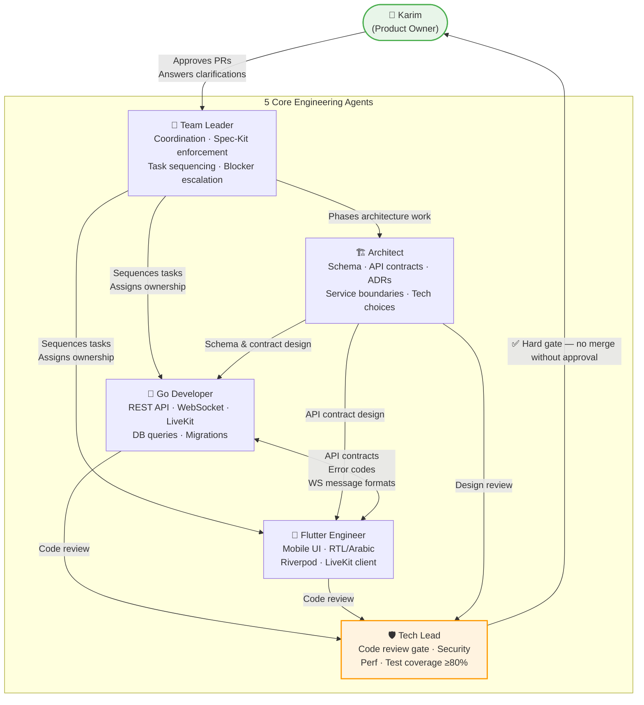
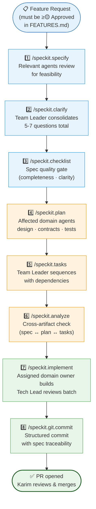

# Halaqaty Multi-Agent Collaboration Guide

**Status**: ✅ Reference Document
**Created**: 2026-04-28
**Purpose**: Define how all engineering agents collaborate autonomously within Halaqaty's development workflow

---

## Overview

> **Execution policy:** This document defines agent responsibilities and
> collaboration boundaries. The authoritative phase routing, Superpowers
> integration, and token-efficiency rules are in
> [`AGENT_WORKFLOW_HARNESS.md`](AGENT_WORKFLOW_HARNESS.md).

This guide documents the collaborative framework for Halaqaty's 5 core engineering agents:

1. **Senior Golang Developer** — Backend services, APIs, concurrency, database
2. **Senior Flutter Mobile Engineer** — Mobile UI, state management, RTL/Arabic support
3. **Architect** — System design, service boundaries, technology choices
4. **Tech Lead** — Code quality, security, performance, testing standards
5. **Team Leader** — Coordination, delivery tracking, Spec-Kit enforcement

---

## Agent Responsibilities & Integration

### 🔧 Senior Golang Developer
**Focus**: Backend services, APIs, concurrency, database, WebSocket, LiveKit integration

**Key Responsibilities**:
- Design and implement REST APIs
- PostgreSQL optimization and schema design
- WebSocket real-time updates
- LiveKit token generation and session management
- Concurrency patterns and goroutine management
- Security: input validation, parameterized queries, rate limiting

**Collaboration Points**:
- **With Flutter Engineer**: API contracts, error codes, response formats, real-time message structures
- **With Architect**: Service design validation, scalability alignment, technology approvals
- **With Tech Lead**: Code review, security review, performance validation
- **With Team Leader**: Task scheduling, integration point coordination

**Clarification Protocol**:
- When API requirements are ambiguous, send only material technical questions to the Team Leader for the consolidated `/speckit.clarify` round
- Questions should cover: data format, error handling, real-time update frequency, performance constraints, authorization rules, testing expectations, offline behavior

---

### 📱 Senior Flutter Mobile Engineer
**Focus**: Mobile UI/UX, state management, RTL/Arabic support, performance

**Key Responsibilities**:
- Flutter widget architecture and state management
- Arabic-first RTL layout and localization
- Real-time session UI (LiveKit, queue, turn-taking)
- Mobile performance optimization
- Platform-specific (iOS/Android) integration
- Accessibility and offline resilience

**Collaboration Points**:
- **With Golang Developer**: API contract validation, error handling alignment, WebSocket coordination
- **With Architect**: State model alignment, performance budget validation
- **With Tech Lead**: Code review, performance validation, test coverage
- **With Team Leader**: Task scheduling, blocker escalation

**Clarification Protocol**:
- When feature requirements are incomplete, send only material product questions to the Team Leader for the consolidated `/speckit.clarify` round
- Questions should cover: user flow, edge cases, platform-specific behavior, offline expectations, acceptance criteria, performance targets, localization scope

---

### 🏗️ Architect
**Focus**: System design, service boundaries, technology choices, scalability strategy

**Key Responsibilities**:
- Define PostgreSQL schema and data models
- Design REST API contracts and real-time patterns
- Ensure clean service boundaries for future decomposition
- Approve technology choices and frameworks
- Document architecture decisions (ADRs)
- Balance MVP speed with long-term scalability

**Collaboration Points**:
- **With Golang Developer**: Backend architecture validation, schema approval
- **With Flutter Engineer**: API contract design, state model alignment
- **With Tech Lead**: Design review, pattern approval, risk mitigation
- **With Team Leader**: Sequencing architecture phases, communicating constraints

**Clarification Protocol**:
- If key architectural constraints are missing, send only material architecture questions to the Team Leader for the consolidated `/speckit.clarify` round
- Questions should cover: expected scale, reliability expectations, compliance/privacy constraints, launch scope, operational budget, growth timeline, vendor lock-in tolerance

---

### 🛡️ Tech Lead
**Focus**: Code quality, security, performance, testing standards, mentoring

**Key Responsibilities**:
- Code review gate for all changes (hard gate — no merge without approval)
- Security vulnerability identification and remediation
- Performance budget enforcement
- Test coverage validation (80%+ business logic, 90%+ critical paths)
- Architectural consistency validation
- Mentoring agents toward best practices

**Collaboration Points**:
- **With Golang Developer**: Backend code review, concurrency validation, API security
- **With Flutter Engineer**: Mobile code review, RTL validation, performance testing
- **With Architect**: Design review, pattern governance, risk escalation
- **With Team Leader**: Quality metrics reporting, blocker resolution

**Clarification Protocol**:
- When code quality standards are unclear, ask Karim **clarifying questions** about:
- Testing requirements for specific domains (real-time, authentication, payment)
- Performance budgets for critical operations
- Security standards for data classification (PII, educational records, financial)
- Acceptable technical debt (none for security; acceptable for MVP speed in non-critical paths)

---

### 👥 Team Leader
**Focus**: Coordination, delivery tracking, cross-agent communication, Spec-Kit enforcement

**Key Responsibilities**:
- Sprint planning and task sequencing
- Define task dependencies and critical path
- Facilitate Golang-Flutter coordination on API contracts
- Spec-Kit workflow enforcement (specify → clarify → checklist → plan → tasks → analyze → implement)
- Blocker escalation and resolution
- Communication hub for all agents

**Collaboration Points**:
- **All Agents**: Coordination, task assignment, blocker resolution, escalation

**Clarification Protocol**:
- When delivery scope is unclear, consolidate the relevant agents' input into **5-7 practical questions total** for the `/speckit.clarify` round
- Questions should cover: release priority, must-have behaviors, acceptable compromises, deadlines, blockers, dependencies, rollback strategy

---

## Agent Collaboration Model



---

## Spec-Kit Workflow Integration (COMPLETE FLOW)

### Full Spec-Kit Workflow With Phase-Scoped Agents



### Key Points for Multi-Agent Collaboration in Spec-Kit

**Specification Phase** (`/speckit.specify`)
- The Team Leader selects only roles material to the feature
- Architect reviews when architectural feasibility or boundaries are affected
- Tech Lead reviews when material security, quality, or testing risk is present
- Golang Developer joins for backend scope; Flutter Engineer joins for mobile scope

**Clarification Phase** (`/speckit.clarify`)
- Ask Karim clarifying questions across all domains
- Only relevant agents provide input on ambiguities in their specialties; the Team Leader removes duplicates
- Result: Clear, unambiguous spec ready for planning

**Checklist Phase** (`/speckit.checklist`)
- Validate spec quality (not implementation)
- Check: completeness, clarity, consistency, coverage, edge cases
- The checklist agent confirms readiness and consults a domain agent only for a material specialty concern

**Planning Phase** (`/speckit.plan`)
- **Team Leader** documents dependencies and integration points
- **Architect** joins when architecture, data models, contracts, or ADR implications are affected
- **Golang Developer** joins for backend API, database, WebSocket, or service work
- **Flutter Engineer** joins for mobile state, UX, localization, or platform work
- **Tech Lead** joins when security, performance, or quality risk warrants review

**Task Generation** (`/speckit.tasks`)
- Break design into independent, testable tasks
- Golang Developer owns backend tasks
- Flutter Engineer owns mobile tasks
- Architect owns schema/API design tasks
- Tech Lead tasks (review, security) are gates
- **Team Leader** sequences tasks respecting dependencies

**Analysis Phase** (`/speckit.analyze`)
- Run consistency checks across spec, plan, tasks
- Identify: inconsistencies, duplications, ambiguities, risks
- Before agents start implementation

**Implementation Phase** (`/speckit.implement`)
- **Golang Developer** implements backend tasks
- **Flutter Engineer** implements mobile tasks
- **Tech Lead** reviews every code change (hard gate)
- **Team Leader** unblocks any cross-team dependencies

---

## Cross-Agent Communication Patterns

### Asynchronous Communication (Primary)
Selected agents can communicate asynchronously when the current phase has a real integration point:

**Example 1**: Backend API Design
```
1. Golang Developer: "Designing POST /circles/{id}/session endpoint"
2. Flutter Engineer: "Need response to include participants[] array for UI rendering"
3. Architect: "Validate this aligns with circle_members schema design"
4. Tech Lead: "Confirm rate limiting and authorization checks are in place"
5. Team Leader: "Coordinate with task scheduling; mobile ready to consume by task #42"
```

**Example 2**: Database Schema Decision
```
1. Architect: "Proposing new queue_state table for real-time tracking"
2. Golang Developer: "Query optimization: suggest composite index on (session_id, turn_order)"
3. Tech Lead: "Performance validation: test query <100ms with 1000-row dataset"
4. Flutter Engineer: "State model impact: need WebSocket message for queue updates"
5. Team Leader: "Sequencing: schema design blocks backend implementation; flutter waits for API"
```

### When Agents Ask Karim Clarifying Questions

**Golang Developer asks** (when API requirements are ambiguous):
- "Should the queue turn API return full participant objects or just IDs?"
- "What error code when student tries to recite twice in a session?"
- "How should we handle offline recitations submitted after session ends?"
- "Do we need pagination for participant lists, and if so, default page size?"
- "Should turn timeout automatically revoke CanPublish or wait for explicit API call?"

**Flutter Engineer asks** (when feature requirements are incomplete):
- "Should the queue UI update in real-time or require manual refresh?"
- "What happens to the UI if WebSocket disconnects during active recitation?"
- "Should we show other participants' attempt counts during their turn?"
- "Is offline queue tracking allowed, or must all operations require online?"
- "Should we show Arabic transliterations for non-native Arabic speakers?"

**Architect asks** (when architectural constraints are unclear):
- "What's the expected growth from 50 to 500 concurrent users — timeline and approach?"
- "Can we use Redis for session caching, or must everything go in PostgreSQL?"
- "Do we need multi-region support in MVP, or is single-server sufficient?"
- "What's the acceptable data loss window if the server crashes mid-session?"
- "Should we prepare for HIPAA/FERPA compliance now or defer to later?"

**Tech Lead asks** (when quality standards are ambiguous):
- "What test coverage is acceptable for real-time WebSocket handlers?"
- "Should we require integration tests for every API endpoint?"
- "What's the security review process for features handling student records?"
- "Are we scanning dependencies for vulnerabilities automatically?"
- "Should we enforce code review on all commits or just to main?"

**Team Leader asks** (when delivery scope is unclear):
- "Are queue and turn-taking features both required for MVP, or is one deferrable?"
- "What's the hard deadline, and should we scope down if needed?"
- "Do we need to support Arabic RTL from day 1, or can we phase it in?"
- "What's the rollback strategy if we discover critical issues post-launch?"
- "Who is responsible for production monitoring and incident response?"

---

## Autonomous Decision-Making Within Scope

| Agent | Can Decide | Requires Escalation |
|---|---|---|
| **Golang Developer** | API implementation, database queries, error codes, performance optimization | Architecture changes, new services, security exceptions |
| **Flutter Engineer** | UI implementation, state management, animations, offline strategy | API contract changes, backend unavailability, security implications |
| **Architect** | System design, service boundaries, technology choices, data model | Business scope changes, major cost implications, security framework changes |
| **Tech Lead** | Code quality standards, security review decisions, test coverage targets | Architecture violations, policy exceptions, performance budgets |
| **Team Leader** | Task sequencing, sprint planning, blocker escalation | Spec-Kit phase decisions, scope changes, business priority conflicts |

---

## File References for Agents

All agents should reference this guide and related documents:

- **This File**: `docs/engineering/collaboration/AGENT_COLLABORATION_GUIDE.md` — How agents collaborate
- **Constitution**: `.specify/memory/constitution.md` — Halaqaty principles, tech stack, security invariants
- **Spec-Kit Agents**: `.github/agents/speckit.*.agent.md` — Individual Spec-Kit workflow agents
- **Engineering Agents**: `.github/agents/senior-*.agent.md` and `.github/agents/architect.agent.md` — This team

---

## Success Metrics for Collaboration

### Delivery Metrics
- ✅ 95%+ sprint task completion rate
- ✅ Zero blockers due to miscommunication between agents
- ✅ All integration points coordinated before implementation

### Quality Metrics
- ✅ All code merged with Tech Lead approval (100% gate compliance)
- ✅ Test coverage ≥80% for business logic, ≥90% for critical paths
- ✅ Zero critical security issues merged
- ✅ API response times <200ms (95th percentile)
- ✅ Database queries <100ms (95th percentile)

### Process Metrics
- ✅ 100% of features follow full Spec-Kit workflow (all 7 phases)
- ✅ Code review turnaround <24 hours
- ✅ Blocker resolution <24 hours
- ✅ Agent escalations rare (<5% of decisions)
- ✅ Clarification questions asked before ambiguous work starts

---

## Quick Reference: Who to Contact

| Need | Primary Contact | Escalation |
|------|---|---|
| API contract question | Golang Developer | → Architect → Tech Lead |
| Mobile UI implementation | Flutter Engineer | → Architect → Tech Lead |
| Architecture decision | Architect | → Team Leader → Karim |
| Code review or security | Tech Lead | → Architect (if architecture) |
| Task sequencing/blockers | Team Leader | → Karim (business decisions) |
| Spec-Kit phase question | Team Leader | (all phases coordinated via Team Leader) |
| Clarification on requirements | Any Agent → **Ask Karim** | (Agents ask questions, don't guess) |

---

## Implementation Checklist

- ✅ All agents created with full role definitions
- ✅ Collaboration model documented for each agent
- ✅ Clarification protocols defined (agents ask Karim when ambiguous)
- ✅ Spec-Kit workflow integrated (all 7 phases)
- ✅ Autonomous decision boundaries defined
- ✅ Escalation paths documented
- ✅ Code quality gates enforced by Tech Lead
- ✅ This guide created as central reference

---

## How Agents Use This Guide

1. **Before Starting Work**: Agent reviews collaboration guide to understand:
   - Who else is involved in this work?
   - What integration points exist?
   - Who do I escalate to if blocked?
   - When do I ask Karim clarifying questions?

2. **During Implementation**:
   - Async communication with other agents on integration points
   - Tech Lead gates all code merges
   - Team Leader unblocks cross-agent dependencies

3. **When Uncertain**:
   - Clarification Protocol: Send material questions to the Team Leader, who consolidates 5-7 focused questions total through `/speckit.clarify`
   - Don't guess; don't make assumptions
   - Get clarity before investing time in wrong direction

4. **Spec-Kit Alignment**:
   - Every agent action aligns with current Spec-Kit phase
   - All 7 phases executed in sequence: specify → clarify → checklist → plan → tasks → analyze → implement
   - Team Leader enforces phase sequencing

---

## File Locations

- `.github/agents/senior-golang-developer.agent.md` (NEW)
- `.github/agents/senior-flutter-mobile-engineer.agent.md` (MODIFIED)
- `.github/agents/architect.agent.md` (MODIFIED)
- `.github/agents/tech-lead.agent.md` (MODIFIED)
- `.github/agents/team-leader.agent.md` (MODIFIED)
- `.specify/memory/constitution.md` (Project principles and constraints)
- `docs/engineering/collaboration/AGENT_COLLABORATION_GUIDE.md` (This file — reference for all agents)

---

## Questions or Updates?

This guide should be updated whenever:
- New agents are added to the team
- Collaboration patterns change
- Escalation procedures need refinement
- Spec-Kit phases are modified
- New clarification protocols are established

Proposed changes should be discussed with **Karim** and reflected back into agent definitions.
