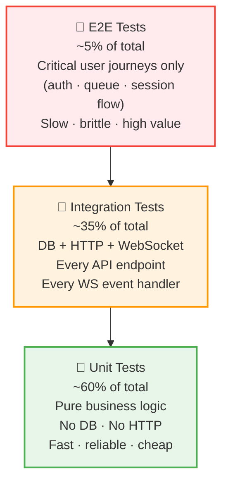

# Testing Strategy

Halaqaty testing strategy for a solo developer with AI agent assistance. Optimizes for confidence in the paths that matter most (auth, queue, payments) while keeping the total test maintenance burden manageable.

## Testing Pyramid



**Ratio target:** ~60% unit · ~35% integration · ~5% E2E

---

## Go Backend Tests

### Unit Tests

**Coverage target:** ≥80% for business logic packages

Packages to unit-test thoroughly:

| Package | What to Test |
|---------|-------------|
| `backend/internal/queue` | Queue ordering, round management, grade submission, idempotency |
| `backend/internal/auth` | JWT validation, role extraction, permission checks |
| `backend/internal/schedule` | Timezone conversion, recurrence calculation, next-occurrence logic |
| `backend/internal/notifications` | FCM payload construction, device token selection |

**Rules:**
- No database in unit tests — mock the repository interface
- No HTTP in unit tests — test service layer directly
- Table-driven tests are the default pattern

```go
func TestQueueService_AddStudent(t *testing.T) {
    cases := []struct {
        name    string
        given   QueueState
        student StudentID
        want    []QueueEntry
        wantErr error
    }{
        // ...
    }
    for _, tc := range cases {
        t.Run(tc.name, func(t *testing.T) { ... })
    }
}
```

---

### Integration Tests

**Tool:** `testcontainers-go` — spins up a real PostgreSQL 16 container per test suite.

**Coverage target:** All HTTP handlers + all WebSocket event handlers

**What to test:**

- Full request → handler → service → DB → response cycle
- All error codes and HTTP status codes documented in `openapi.yaml`
- WebSocket event delivery after state-changing REST calls
- Database constraint violations (duplicate invite codes, FK violations, etc.)
- Migration up/down cycle: `migrate up` from zero should produce the expected schema

**Test database setup:**

```go
// In TestMain:
// 1. Start PostgreSQL testcontainer
// 2. Run all migrations
// 3. Seed quran_surahs reference data
// 4. Run tests
// 5. Teardown container
```

---

### Contract Tests

The `openapi.yaml` spec is the contract. After any handler change:

1. Run `npx @redocly/cli lint docs/contracts/openapi.yaml` — zero errors required
2. Run integration tests with request/response validation against the OpenAPI spec

**Tool:** `kin-openapi` or `go-openapi-validator` to validate test request/response pairs match the spec.

---

## Flutter (Mobile) Tests

### Unit Tests (Dart)

**Tool:** `flutter test`

**Target:** All Riverpod providers, state notifiers, and domain model classes

```
test/
  unit/
    providers/
      queue_provider_test.dart
      session_provider_test.dart
      auth_provider_test.dart
    models/
      queue_entry_test.dart
      circle_test.dart
```

---

### Widget Tests

**Tool:** `flutter test` with `WidgetTester`

**What to test:** UI components that contain business logic (queue list ordering, grade selection, session controls)

**What NOT to test with widget tests:** Simple display-only widgets — use screenshot tests instead.

---

### Integration Tests (Flutter)

**Tool:** `flutter_test` + `integration_test` package

Run against a local dev backend (not production). Key journeys:

| Journey | Steps |
|---------|-------|
| Teacher creates session | Login → navigate to circle → start session → verify LiveKit connection |
| Student joins queue | Login → join session → tap "Join Queue" → verify position shown |
| Full recitation turn | Teacher starts round → student sees "Your turn" → teacher grades → verify queue advances |

---

## WebSocket Contract Tests

The `ws_events.md` document defines the event schema. Validated by:

1. Go integration tests: verify each WS event matches the JSON schema in `ws_events.md`
2. A shared JSON schema file (generated from `ws_events.md`) used by both Go and Flutter tests

---

## Security Tests (Manual — Each Release)

Performed by Karim before every milestone release:

| Check | Description |
|-------|-------------|
| Auth bypass | Attempt to access protected endpoints without a valid JWT |
| IDOR | Attempt to access another user's circle/session/messages by ID |
| Privilege escalation | Student calling teacher-only endpoints |
| Input validation | Send oversized inputs, SQL injection strings, invalid Ayah ranges |
| FCM token hijack | Attempt to register another user's device token |

---

## Performance Tests

**Trigger:** Before each milestone release (M1, M2, M3, M4)

**Tool:** `k6` (scripted load tests)

**Scenarios:**

| Scenario | Load | Target |
|----------|------|--------|
| 30 concurrent students in one queue session | 30 WS connections + REST | p99 queue event latency < 200ms |
| 100 concurrent circle chat users | 100 WS connections | p99 message delivery < 500ms |
| 10 simultaneous sessions | 300 total WS connections | Server CPU < 70%, no dropped connections |

---

## CI/CD Gates

All must pass before merge:

```yaml
# .github/workflows/ci.yml
- run: go test ./... -race -coverprofile=coverage.out
- run: go tool cover -func=coverage.out | grep total  # must be >= 80%
- run: flutter test
- run: npx @redocly/cli lint docs/contracts/openapi.yaml
```

Coverage drops below 80% on new code → PR blocked.

---

## Test Data

**Go:** Use `testdata/` fixtures for static inputs (valid/invalid JWT payloads, queue state snapshots).

**Seed data:** The `quran_surahs` reference table is seeded in every test database via `backend/migrations/seed_quran_surahs.sql`. Tests that validate Ayah range rejection (e.g., Al-Baqarah has 286 Ayahs) rely on this seed being present.

---

## What We Deliberately Don't Test

| Area | Reason |
|------|--------|
| Firebase Auth itself | Tested by Google; we mock the JWT validator in tests |
| LiveKit server | Tested by LiveKit; we mock the LiveKit SDK in Go unit tests |
| MinIO file storage | We mock the storage interface; content-addressed storage is deterministic |
| Flutter rendering pixel-perfect | Too brittle; focus on logic, not pixels |

---

*See [DEVELOPMENT.md](../../../DEVELOPMENT.md) for how tests are run in the CI/CD pipeline.*
