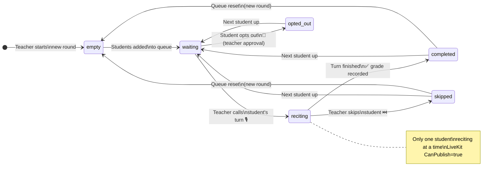
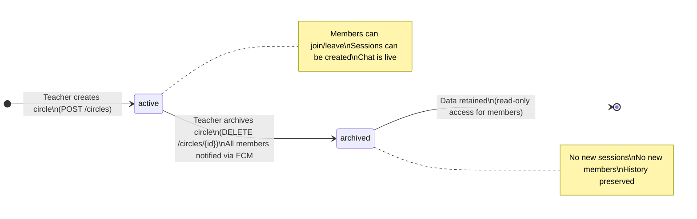

# Halaqaty — Feature Specification & Status Board

> **Version:** 1.0 | **Status:** Planning Phase | **Last Updated:** 2026

**Related Documents:** [FEATURES_AR.md](../arabic/FEATURES_AR.md) · [PROJECT_PLAN.md](../planning/PROJECT_PLAN.md) · [ARCHITECTURE.md](../../engineering/architecture/ARCHITECTURE.md) · [DEVELOPMENT.md](../../../DEVELOPMENT.md) · [AGENT_COLLABORATION_GUIDE.md](../../engineering/collaboration/AGENT_COLLABORATION_GUIDE.md)

This is a **living document**. It tracks every feature from proposal through delivery, hosts design discussions, and captures open questions for the team.

**Workflow Note**: Features marked `🟡 Approved` are ready for development using Spec-Kit. To start building:

1. Run `/speckit.specify` in VS Code Copilot Chat for the feature
2. Follow all 7 Spec-Kit phases: specify → clarify → checklist → plan → tasks → analyze → implement
3. The 5 specialized agents (Golang Developer, Flutter Engineer, Architect, Tech Lead, Team Leader) will collaborate autonomously
4. See [DEVELOPMENT.md](../../../DEVELOPMENT.md) and [AGENT_COLLABORATION_GUIDE.md](../../engineering/collaboration/AGENT_COLLABORATION_GUIDE.md) for detailed workflow

---

## Priority Levels

| Level | Meaning |
|-------|---------|
| P0 | Core MVP: must launch with this |
| P1 | Important: ship in first major update |
| P2 | Enhancement: valuable but not urgent |
| P3 | Future: long-term roadmap |

---

## Status Legend

| Status | Symbol | Meaning |
|--------|--------|---------|
| Proposed | 🔵 | Feature identified; not yet reviewed by team |
| Approved | 🟡 | Team has agreed to build this |
| In Progress | 🟠 | Actively being developed |
| Done | 🟢 | Shipped and verified |
| Rejected | 🔴 | Decided not to build (with reason) |

---

## Feature Status Table

| ID | Feature | Priority | Status | Phase | Owner |
|----|---------|----------|--------|-------|-------|
| [F-001](#f-001-user-management--authentication) | User Management & Authentication | P0 | 🟡 Approved | 1 | Backend |
| [F-002](#f-002-circle-management) | Circle Management | P0 | 🟡 Approved | 1 | Full Stack |
| [F-003](#f-003-recitation-queue-system) | 🔥 Recitation Queue System | P0 | 🟡 Approved | 2 | Full Stack |
| [F-004](#f-004-real-time-chat) | Real-time Chat | P0 | 🟡 Approved | 1 | Backend |
| [F-005](#f-005-live-sessions-livekit) | Live Sessions (Audio-only, LiveKit) | P0 | 🟡 Approved | 2 | Full Stack |
| [F-006](#f-006-schedule--calendar) | Schedule & Calendar | P0 | 🟡 Approved | 2 | Full Stack |
| [F-007](#f-007-memorization-progress-tracking) | Memorization Progress Tracking | P1 | 🔵 Proposed | 3 | Full Stack |
| [F-008](#f-008-notification-system) | Notification System | P1 | 🔵 Proposed | 2 | Backend |
| [F-009](#f-009-built-in-digital-mushaf) | Built-in Digital Mushaf | P2 | 🔵 Proposed | 4 | Mobile |
| [F-010](#f-010-student--teacher-dashboards) | Student & Teacher Dashboards | P2 | 🔵 Proposed | 3 | Full Stack |
| [F-011](#f-011-reports--statistics) | Reports & Statistics (PDF) | P2 | 🔵 Proposed | 3 | Backend |
| [F-012](#f-012-multi-language-support) | Multi-language Support | P2 | 🔵 Proposed | 3 | Mobile |
| [F-013](#f-013-ai-tajweed-assessment) | AI Tajweed Assessment | P3 | 🔵 Proposed | 5 | AI/Backend |
| [F-014](#f-014-ai-memorization-planner) | AI Memorization Planner | P3 | 🔵 Proposed | 5 | AI/Backend |
| [F-015](#f-015-certificate-system) | Certificate System | P3 | 🔵 Proposed | 4 | Full Stack |
| [F-016](#f-016-desktop-app) | Desktop App (Flutter) | P3 | 🔵 Proposed | 5 | Mobile |
| [F-017](#f-017-institutional-platform) | 🏢 Institutional Platform | P3 | 🔵 Proposed | 5 | Full Stack |

---

## Detailed Feature Discussions

---

### F-001: User Management & Authentication

**Priority:** P0 | **Status:** 🟡 Approved | **Phase:** 1

#### Description

Secure, multi-method user registration and authentication system with role-based access control. This is the foundation everything else depends on.

#### User Stories

- As a new user, I can register with email/password, Google, Apple, or phone OTP so I can start using Halaqaty quickly
- As a registered user, I can log in securely from any device
- As a user, I can set and update my profile (name, avatar, bio)
- As a teacher, I can optionally complete verification to build trust with students

#### Acceptance Criteria

- [ ] Email/password registration with email verification link
- [ ] Google Sign-In (OAuth 2.0)
- [ ] Apple Sign-In (required for iOS App Store policy compliance)
- [ ] Phone OTP verification (WhatsApp-style; critical for Arabic-speaking markets with lower email usage)
- [ ] JWT session management backed by Firebase Auth
- [ ] User profile: display name, avatar (stored in MinIO), bio (optional), preferred language
- [ ] Password reset via email
- [ ] Account deletion with data erasure (GDPR/privacy compliance)
- [ ] Device token registration for FCM push notifications


---

### F-002: Circle Management

**Priority:** P0 | **Status:** 🟡 Approved | **Phase:** 1

#### Description

Circles are the core organizational unit. A circle is a Quran memorization group with a teacher, students, optional supervisors, and associated sessions, chat, and progress records.

#### User Stories

- As a teacher, I can create a circle with a name, description, and rules so students know what to expect
- As a teacher, I can generate an invite code/link to share with students
- As a student, I can join multiple circles simultaneously with different teachers
- As a teacher, I can assign the Supervisor role to a trusted member at any time
- As a teacher, I can set circle privacy (public/discoverable vs private/invite-only)

#### Acceptance Criteria

- [ ] Create circle: name (required, max 100 chars), description (optional, max 500 chars), circle rules (optional, max 1000 chars), max capacity (default 50, max 200)
- [ ] Auto-generate unique 8-character invite code on creation
- [ ] Shareable deep link: `halaqaty.app/join/{code}`
- [ ] Invite code can be regenerated (old code invalidated) by teacher
- [ ] Student can join up to **5 circles** simultaneously (configurable limit)
- [ ] Teacher can assign Supervisor role to any circle member at any time (before session, during session, after session)
- [ ] Supervisor role can be revoked by teacher at any time
- [ ] Circle privacy: **Public** (discoverable in explore/search) vs **Private** (invite-only)
- [ ] Circle settings: language, gender specification (male/female/mixed/unspecified)
- [ ] Teacher can archive a circle (preserves all history, prevents new activity)
- [ ] Teacher can delete a circle (with confirmation; permanently deletes all data)
- [ ] Circle member list shows all members with roles, visible to all members


---

### F-003: Recitation Queue System

**Priority:** P0 | **Status:** 🟡 Approved | **Phase:** 2

#### Description

The most unique and differentiating feature of Halaqaty. An intelligent, real-time ordered queue for student recitation during live sessions. This replaces the chaotic verbal ordering common in circles today.

#### User Stories

- As a teacher, I can see all students in an ordered queue during a live session
- As a student, I can see my position in the queue and know when it's my turn
- As a teacher, I can start a new recitation round specifying Surah and Ayah range
- As a teacher, I can reset the queue to start a new round (e.g., switch from new memorization to revision)
- As a teacher/supervisor, I can reorder, skip, or move students in the queue
- As a student, I receive a notification when it's my turn to recite
- As a teacher, I can grade a student's recitation immediately after they finish

#### Why This is the Killer Feature

Current pain point: In a typical online Quran circle, the teacher verbally says "now it's Ali's turn, then Fatima, then Omar..." — this is unstructured, hard to track, and leaves no record. Halaqaty makes the queue visible, interactive, and fully logged.

#### Queue States



#### Round System — Detailed Specification

Each session consists of one or more **rounds**. A round defines:

- `round_number` — 1, 2, 3, ...
- `round_type` — `new_memorization` | `revision` | `old_revision` | `test`
- `surah_name` — e.g., "Al-Baqarah"
- `from_ayah` — integer, e.g., 1
- `to_ayah` — integer, e.g., 20

When teacher resets the queue:

1. All entries in current round are marked as final
2. A new round record is created with new Surah/Ayah range
3. All students' statuses reset to ⏳ Waiting
4. Queue ordering can be re-configured for the new round

#### Grading Scale

The following 6-grade scale applies to all recitation entries in this circle. This is the canonical product definition; database enum values and Arabic display labels are in [ARCHITECTURE.md §4.0](../../engineering/architecture/ARCHITECTURE.md#40-domain-enumerations).

| Grade | DB Value | Arabic | Meaning |
|-------|----------|--------|---------|
| Excellent | `excellent` | ممتاز | Perfect recitation, excellent tajweed |
| Very Good | `very_good` | جيد جداً | Minor errors, good tajweed |
| Good | `good` | جيد | Some errors, acceptable tajweed |
| Acceptable | `acceptable` | مقبول | Notable errors, basic tajweed |
| Needs Review | `needs_review` | يحتاج مراجعة | Significant errors; review required |
| Repeat | `repeat` | إعادة | Must fully repeat before advancing |

#### Real-Time Sync Requirements

- Queue state must be visible to all session participants simultaneously
- Latency target: < 500ms from teacher action to all clients reflecting update
- Technology: WebSocket broadcast to all session participants
- Offline handling: client should show "Reconnecting..." and re-sync queue state on reconnect
- Idempotency: duplicate WebSocket events must not cause double-state changes

#### Acceptance Criteria

- [ ] Queue visible to all session participants in real-time via WebSocket
- [ ] Minimum 3 ordering modes: join order, teacher manual, supervisor manual
- [ ] Per-round metadata: Surah name, from Ayah, to Ayah, round type
- [ ] Queue can be reset unlimited times per session
- [ ] When student's turn starts: in-app and push notification sent immediately
- [ ] Teacher can mute all → unmute only current reciter when their turn starts
- [ ] Grading mode configurable per circle (required or optional per completed turn)
- [ ] Student audio publish permission is teacher-controlled per turn (grant on turn start, revoke after turn)
- [ ] Teacher notes field per grading entry (free text, max 500 chars)
- [ ] Full session log persisted after session ends
- [ ] Queue handles students who join the session late (added to end of current round queue)
- [ ] Queue handles network disconnections gracefully (state preserved server-side)
- [ ] Student can request a temporary skip/opt-out for current turn (e.g., mic issue, permission break), approved by teacher/supervisor


#### Design Decisions

- **DD-020:** Queue state is stored server-side in PostgreSQL (not just in-memory). This ensures history is preserved and reconnecting clients can recover state.
- **DD-021:** WebSocket events are the delivery mechanism, but PostgreSQL is the source of truth.
- **DD-022:** Grading mode is configured per circle (required vs optional per completed turn).
- **DD-023:** Temporary student opt-out is allowed for operational issues and is logged in queue history.
- **DD-024:** Late-joining students are appended to the end of the current active round.
- **DD-025:** A 6-grade recitation scale was chosen over simpler alternatives (4-grade or binary pass/fail) to reflect the nuanced evaluation used in traditional Quranic teaching. The granularity between "needs targeted revision" (Needs Review) and "must fully repeat" (Repeat) is pedagogically significant in tajweed assessment, and aligns with established practice in Quran circles and the ijazah tradition.

#### Dependencies

- F-001 (User Auth)
- F-002 (Circle Management)
- F-005 (Live Sessions — queue exists within a session)
- F-008 (Notification System — turn notifications)

---

### F-004: Real-time Chat

**Priority:** P0 | **Status:** 🟡 Approved | **Phase:** 1

#### Description

Full-featured messaging within circles, replacing WhatsApp/Telegram group chats and enabling structured communication between teachers and students.

#### User Stories

- As a member, I can send messages in the circle group chat
- As a teacher, I can send a private message or voice note to a student
- As a teacher, I can pin important messages for all members to see
- As a student, I can record and send a voice note with my recitation for practice

#### Acceptance Criteria

- [ ] Group chat: one per circle, all members can participate
- [ ] Direct messages: teacher ↔ student (one-on-one); supervisor ↔ student
- [ ] **Voice messages** — record in-app, send, visualize waveform, playback; stored in MinIO
- [ ] Image attachments: JPEG, PNG; max 5MB per image
- [ ] File attachments: PDF only (for Mushaf pages, exercises); max 10MB
- [ ] Message delivery status: sent ✓ / delivered ✓✓ / read ✓✓ (blue)
- [ ] Typing indicators ("Ali is typing...")
- [ ] Full-text message search within a circle's chat history
- [ ] Pin messages: teacher/supervisor only; max 5 pinned per circle; pinned bar shown above chat
- [ ] Reply to specific message (shows quoted preview)
- [ ] Delete own messages within 10 minutes; teachers can delete any message
- [ ] WebSocket delivery when app is open; FCM push when app is in background
- [ ] Offline mode: messages queued locally and sent when connection restored


---

### F-005: Live Sessions (LiveKit)

**Priority:** P0 | **Status:** 🟡 Approved | **Phase:** 2

#### Description

Unlimited-time audio-only sessions powered by LiveKit (open-source, self-hosted WebRTC SFU). This is the primary replacement for Zoom/Google Meet in MVP. Video is deferred to post-MVP behind a feature flag.

#### User Stories

- As a teacher, I can start a live session from the circle page with one tap
- As a student, I can join a session from a push notification or calendar reminder
- As a teacher, I can mute/unmute individual participants
- As a teacher, I can lock the room to prevent new joiners mid-session
- As a participant, I can raise my hand to signal the teacher
- As a teacher, I can trust that live-session audio is not recorded in MVP

#### Why LiveKit?

- **Open-source:** No per-minute costs; self-hosted = full control
- **WebRTC-based:** Industry-standard, browser and mobile compatible
- **Official Flutter SDK:** `livekit_client` package with active maintenance
- **No time limits:** Unlike Zoom free tier (40 min), LiveKit sessions are unlimited
- **Audio quality control:** Can disable noise suppression, adjust bitrates — critical for Quran recitation

#### Audio Configuration (Critical)

Quran recitation requires preservation of specific phonetic qualities (tajweed) that voice-optimized audio processing can distort:

```yaml
# LiveKit room audio configuration
audio:
  codec: opus
  bitrate: 48000        # 48kbps minimum (vs Zoom's ~32kbps)
  noise_suppression: false   # OFF — preserves makhraj subtleties
  auto_gain_control: false   # OFF — consistent recitation volume
  echo_cancellation: true    # ON — still needed to prevent feedback
```

#### LiveKit Integration Flow

```
Step 1: Session Creation
  Teacher taps "Start Session" in Flutter app
       ↓
  Flutter → POST /api/v1/sessions/{id}/start → Go Backend
       ↓
  Go Backend calls LiveKit Server API → Creates room "{session_id}"
       ↓
  Go Backend returns: { livekit_token: "eyJ...", livekit_url: "wss://..." }

Step 2: Token Generation (Go Backend)
  Using livekit-server-sdk-go:
  at := auth.NewAccessToken(lkApiKey, lkApiSecret)
  grant := &auth.VideoGrant{RoomJoin: true, Room: roomName, CanPublishVideo: false} // MVP audio-only
  at.AddGrant(grant).SetIdentity(userID).SetValidFor(time.Hour)
  token, _ := at.ToJWT()

Step 3: Flutter Connects
  Flutter livekit_client package:
  room = await LiveKitClient.connect(livekitUrl, token, roomOptions)

Step 4: Media Routing
  LiveKit SFU routes audio streams between all participants
  Teacher controls (mute, remove) via Flutter → REST → Go → LiveKit API
```

#### Acceptance Criteria

- [ ] Flutter package: `livekit_client` (official) integrated
- [ ] Token generation exclusively on Go backend (never client-side)
- [ ] Audio-only in MVP (no video toggle in app)
- [ ] No time limits
- [ ] Teacher controls: mute all, mute individual, remove participant, lock room (no new joiners)
- [ ] Hand raise: students tap 🤚 → appears in teacher's UI; integrated with recitation queue
- [ ] Screen sharing is deferred to post-MVP (same feature-flag family as video)
- [ ] Session recording is disabled in MVP and deferred until a privacy consent/retention framework is approved
- [ ] Audio: Opus 48kbps+, noise suppression OFF, auto-gain OFF
- [ ] Maximum 50 participants (scalable with server resources)
- [ ] Graceful reconnection on network drop (LiveKit SDK handles this)


---

### F-006: Schedule & Calendar

**Priority:** P0 | **Status:** 🟡 Approved | **Phase:** 2

#### Description

Recurring weekly schedule management with smart reminders and integrated attendance tracking.

#### User Stories

- As a teacher, I can set a recurring weekly schedule for my circle
- As a student in multiple circles, I can see a unified calendar of all my sessions
- As a student, I receive configurable push notification reminders before sessions
- As a teacher, I can record manual attendance (override for students who called ahead)

#### Acceptance Criteria

- [ ] Weekly recurring schedule per circle: day(s) of week, start time, end time, timezone
- [ ] A circle can have multiple schedule entries (e.g., Sun + Wed)
- [ ] Push notifications: configurable reminder intervals (1hr, 30min, 15min, 5min before session)
- [ ] Auto-attendance: when student joins LiveKit session → marked Present
- [ ] Manual override: teacher can mark Present / Absent / Excused for any student
- [ ] Unified calendar: students in multiple circles see all sessions in one color-coded calendar view
- [ ] Conflict detection: alert if two circles have overlapping scheduled times
- [ ] Session lifecycle: Scheduled → Live (auto when teacher starts) → Completed (auto after end) → Cancelled (manual)

#### Circle Lifecycle State Machine




---

### F-007: Memorization Progress Tracking

**Priority:** P1 | **Status:** 🔵 Proposed | **Phase:** 3

#### Description

Advanced per-student Quran memorization analytics, automatically populated from recitation queue history with teacher grading. MVP baseline remains session-level progress visibility (history + grades).

#### Acceptance Criteria

- [ ] Auto-create memorization record from each completed recitation queue entry
- [ ] Fields per record: student, circle, session, round type (new/revision), surah, from_ayah, to_ayah, grade, teacher notes, date
- [ ] Separate views: New Memorization tab vs Revision tab
- [ ] Visual Quran map: 114-surah grid, color-coded (memorized/partial/not started)
- [ ] Progress charts: Ayahs memorized per week/month (line graph)
- [ ] Attendance correlation: days attended vs progress made
- [ ] Teacher dashboard: side-by-side comparison of all students' progress


---

### F-008: Notification System

**Priority:** P1 | **Status:** 🔵 Proposed | **Phase:** 2

#### Description

Multi-channel notification system ensuring no important event is missed.

#### Notification Matrix

| Event | Push (FCM) | In-App (WS) | Configurable OFF? |
|-------|-----------|------------|------------------|
| Session reminder (1hr/30min/15min/5min) | ✅ | ✅ | ✅ |
| New group message | ✅ | ✅ | ✅ |
| New private message | ✅ | ✅ | ❌ (always on) |
| Grade posted | ✅ | ✅ | ✅ |
| Circle invitation | ✅ | ✅ | ❌ |
| Queue: "You're next!" | ✅ | ✅ | ❌ |
| Queue: "Your turn!" | ✅ | ✅ | ❌ |
| Student joined session (→ teacher) | ❌ | ✅ | ✅ |

#### Acceptance Criteria

- [ ] FCM integration for background/closed state
- [ ] WebSocket-based in-app notification bell for foreground state
- [ ] Per-notification-type preferences in Settings
- [ ] Quiet hours: no notifications between user-defined hours (default: 10pm–7am)
- [ ] Notification history page in app (last 30 days)
- [ ] Unread notification count badge on app icon

---

### F-009: Built-in Digital Mushaf

**Priority:** P2 | **Status:** 🔵 Proposed | **Phase:** 4

#### Description

Integrated Quran text (Uthmani script) with Ayah-level interaction tied to memorization records.

#### Acceptance Criteria

- [ ] Full Quran text (Uthmani script) displayed page-by-page
- [ ] Tap any Ayah to link to memorization records
- [ ] Highlight memorized portions visually
- [ ] Teacher can share specific Mushaf pages during sessions (screen share)


---

### F-010: Student & Teacher Dashboards

**Priority:** P2 | **Status:** 🔵 Proposed | **Phase:** 3

#### Description

Role-based dashboards for student self-tracking and teacher oversight across circles.

#### Acceptance Criteria

- [ ] Student dashboard shows own attendance, grades, notes, and memorization progress
- [ ] Teacher dashboard shows all students taught by that teacher with summary metrics
- [ ] Circle dashboard shows per-circle progress, attendance, and queue history
- [ ] No parent-linked account management in MVP scope

---

### F-011: Reports & Statistics

**Priority:** P2 | **Status:** 🔵 Proposed | **Phase:** 3

#### Description

Comprehensive reporting for teachers and students, with PDF export capability.

#### Acceptance Criteria

- [ ] Teacher: per-student report covering attendance %, grades distribution, memorization progress
- [ ] Student: self-view of own report
- [ ] PDF export for sharing with students or institutions
- [ ] Charts: line graphs, heatmaps, Quran completion wheels

#### Report Types

- **Student Progress Report:** Attendance %, grades distribution, memorization progress, trend charts
- **Circle Overview Report:** All students side-by-side, session history, top performers
- **Custom Date Range Reports**


---

### F-012: Multi-language Support

**Priority:** P2 | **Status:** 🔵 Proposed | **Phase:** 3

#### Languages (Priority Order)

1. Arabic (default, RTL) — core market
2. English (LTR)
3. Urdu (RTL) — large Muslim community in Pakistan, India, UK
4. Malay (LTR) — Southeast Asia
5. Turkish (LTR)
6. French (LTR) — North Africa diaspora

#### Acceptance Criteria

- [ ] Full RTL layout support for Arabic and Urdu
- [ ] Locale-aware date/time formatting
- [ ] Locale-aware number formatting (Eastern Arabic numerals option)
- [ ] Language preference saved per user account

---

### F-013: AI Tajweed Assessment

**Priority:** P3 | **Status:** 🔵 Proposed | **Phase:** 5

> **Dependency note:** This feature is blocked until post-MVP recording is available with an approved privacy consent/retention framework.

#### Acceptance Criteria

- [ ] Integration with post-MVP recording (when available)
- [ ] AI-powered tajweed error detection with timestamp references
- [ ] Grade suggestion for teacher (teacher can override)
- [ ] Error report with makhraj, madd, tanwin, noon sakinah, waqf analysis
- [ ] Grade suggestion to assist teacher, not replace teacher's grading
- [ ] Support for different recitation schools (Qira'at)

#### Description

AI-powered analysis of student recitation audio to detect tajweed errors and assist teachers in grading.

#### How It Works

1. Session recording (or dedicated recitation recording) is processed
2. Audio segmented per student turn (using recitation queue timestamps)
3. AI model analyzes:
   - Makhraj (articulation points) correctness
   - Madd (elongation) lengths
   - Tanwin and noon sakinah rules
   - Waqf (stopping) correctness
4. Error report generated with timestamp references
5. Grade suggestion provided to teacher (teacher can override)


---

### F-014: AI Memorization Planner

**Priority:** P3 | **Status:** 🔵 Proposed | **Phase:** 5

#### Description

Personalized memorization schedule based on student's historical pace.

#### Acceptance Criteria

- [ ] Analyze student's historical pace (Ayahs memorized per week)
- [ ] Suggest a personalized memorization plan to complete a target (e.g., 1 Juz in 3 months)
- [ ] Adaptive: adjust plan based on actual performance

#### Algorithm (Conceptual)

- Analyze: Ayahs memorized per session, session frequency, grade distribution
- Apply spaced repetition principles (adapted for Quran, not generic flashcards)
- Generate: weekly plan (e.g., "Memorize 5 Ayahs from Al-Imran on Mon/Wed/Fri; Revise Al-Fatiha on Tue/Thu")
- Adaptive: if student underperforms one week, reduce next week's target automatically

---

### F-015: Certificate System

**Priority:** P3 | **Status:** 🔵 Proposed | **Phase:** 4

#### Description

Digitally-signed completion certificates for Juz, Khatm al-Quran, or custom milestones.

#### Acceptance Criteria

- [ ] Teacher awards certificate upon completion of Juz, full Quran (Khatm), or milestone
- [ ] Digitally signed certificate with QR code for verification
- [ ] Shareable as PDF or image

#### Certificate Types

- Juz completion (30 types)
- Complete Quran (Khatm)
- Custom milestone (teacher-defined)

#### Technical Approach

- PDF certificate generated server-side with teacher's signature and circle name
- QR code embedded → verifiable link showing student name, teacher, date, milestone
- Shareable: student can download and share on social media

---

### F-016: Desktop App

**Priority:** P3 | **Status:** 🔵 Proposed | **Phase:** 5

#### Description

Flutter Desktop builds providing a native experience for teachers who prefer desktop.

#### Acceptance Criteria

- [ ] Flutter Desktop builds for Windows, macOS, Linux
- [ ] Targeted at teachers who prefer desktop for session management
- [ ] Optimized for performance on desktop
- [ ] Full feature parity with mobile apps

**Platforms:** Windows, macOS, Linux

**Primary use case:** Teachers using desktop for session management, progress review, and report generation.

---

### F-017: Institutional Platform

**Priority:** P3 | **Status:** 🔵 Proposed | **Phase:** 5

#### Description

The most significant long-term business feature. Enables Quran memorization institutions to manage all their circles and teachers centrally.

#### Target Institutions

- Quran memorization schools (مدارس تحفيظ القرآن)
- Mosque-affiliated circles
- Islamic universities and colleges
- National Quran competition bodies
- Online Quran academies

#### Features

- Institution registration with approval process
- Centralized teacher onboarding (invite teachers, assign them circles)
- Centralized student enrollment (bulk import via CSV)
- Institution-wide analytics dashboard
- Custom branding (logo, color scheme, custom subdomain: `al-noor.halaqaty.app`)
- Academic year management (terms, exams, final assessments)
- Institution-level certificate templates
- Billing: institution pays per teacher (B2B model)

#### Business Impact

This single feature could generate more revenue than all individual subscriptions combined, while serving the organizations that most need a solution.

---

## Open Questions Log

All open questions from feature discussions, consolidated:

| ID | Question | Feature | Status | Decision |
|----|---------|---------|--------|---------|
| OQ-001 | Phone-only accounts (no email)? | F-001 | Decided | No phone-only accounts in MVP. Require email or social provider. Phone is supplementary verification only. |
| OQ-002 | Teacher identity verification? | F-001 | Decided | Optional (not required in MVP) |
| OQ-003 | Session token expiry policy? | F-001 | Decided | Firebase default 1hr auto-refresh. Backend enforces 30-day inactivity logout. |
| OQ-004 | Co-teacher role distinct from supervisor? | F-002 | Decided | Deferred post-pilot. MVP uses teacher + supervisor only. No co-teacher role in MVP. |
| OQ-005 | Cross-circle role combinations? | F-002 | Decided | Yes — roles are fully independent per circle. A user can be teacher in one circle and student in another. |
| OQ-006 | Circle ownership transfer on account deletion? | F-002 | Decided | Circle is archived on teacher account deletion; members are notified. Teacher must assign a supervisor before deletion. No automatic transfer. |
| OQ-007 | Student "opt-out" of a round? | F-003 | Decided | Allowed for temporary issues with teacher/supervisor approval |
| OQ-008 | Per-student recitation timer? | F-003 | Decided | No timer in MVP. Teacher manages timing verbally. |
| OQ-009 | Pre-set queue before session starts? | F-003 | Decided | Yes — teacher can pre-order the queue before starting the session. |
| OQ-010 | Late-joining student added to current round? | F-003 | Decided | Added to end of current active round |
| OQ-011 | Double-queue per student per round? | F-003 | Decided | No. One position per student per round. Use sequential rounds for multiple recitations. |
| OQ-012 | Announcement-only channels? | F-004 | Decided | No announcement channels in MVP. Use pinned messages for circle-wide announcements. |
| OQ-013 | Voice message maximum length? | F-004 | Decided | Max 5 minutes (300 seconds). Max file size: 20 MB. |
| OQ-014 | Emoji reactions? | F-004 | Decided | Deferred to post-MVP (P2). Not in MVP scope. |
| OQ-015 | Student video permission model? | F-005 | Decided | MVP is audio-only; no video permission in MVP |
| OQ-016 | Max session duration for server sizing? | F-005 | Decided | Max 4 hours per session. Idle room timeout: 30 minutes after last participant leaves. |
| OQ-017 | Recording visibility (teacher-only vs all)? | F-005 | Deferred | Recording disabled until privacy framework approval; finalize model before activation |
| OQ-018 | Non-recurring (one-off) sessions? | F-006 | Decided | Yes — teacher can create one-off sessions not linked to a recurring schedule. |
| OQ-019 | Timezone storage strategy? | F-006 | Decided | UTC stored in DB. IANA timezone string stored per user profile. All display in user's local timezone. |
| OQ-020 | Student self-logging (outside sessions)? | F-007 | Decided | No in MVP. Progress records are generated from session-based recitations only. |
| OQ-021 | Multiple passes on same section? | F-007 | Decided | Yes — each queue entry creates a new progress record. Full history of all passes is retained. |
| OQ-022 | Open-source vs licensed Mushaf text? | F-009 | Decided | Tanzil.net (CC BY 3.0, open-source). No licensing cost. |
| OQ-023 | Audio recitation playback in Mushaf? | F-009 | Decided | No in MVP. Mushaf viewer is reading-only. Audio playback deferred to P2. |
| OQ-024 | Auto-generated monthly reports via email? | F-011 | Decided | No in MVP. Manual PDF export only. |
| OQ-025 | In-house AI model vs licensed for Tajweed? | F-013 | Decided | Fully deferred. No AI architecture decision until recording feature is unblocked and privacy framework is approved. |
| OQ-026 | Audio privacy/consent for AI processing? | F-013 | Decided | Fully deferred. No AI architecture decision until recording feature is unblocked and privacy framework is approved. |

---

## Community Suggestions

*This section will be populated once the platform launches and user feedback comes in.*

Ideas from the broader community will be logged here for team review:

| # | Suggestion | Source | Date | Status |
|---|-----------|--------|------|--------|
| CS-001 | *(no suggestions yet — submit via GitHub Discussions after launch)* | — | — | — |

---

## Appendix: Competitor Analysis Alignment

The [Competitor Analysis](../business/QURAN_MEMORIZATION_COMPETITOR_ANALYSIS.md) recommends several immediate actions. This table maps each recommendation to the current feature backlog:

| Competitor Rec | Status in Halaqaty |
|---------------|-------------------|
| Hifz mode UX | Addressed by F-003 (Recitation Queue System, P0) — turn-based queue replaces ad-hoc verbal ordering |
| Script profile parity (Hafs, Warsh) | Not in current backlog — add as P2 item in F-009 (Digital Mushaf) if pilot teachers request |
| Free correction quota | MVP is fully free; correction/grading is unrestricted in all tiers |
| Audio quality for recitation | Addressed by F-005 LiveKit config (noise suppression OFF, Opus 48 kbps min) |

**Note:** The competitor analysis is treated as **strategic input**, not committed scope. Items not mapped above are deferred to the post-pilot backlog.

---

*This document is maintained alongside [arabic/FEATURES_AR.md](arabic/FEATURES_AR.md). Any business-facing changes here must be mirrored there.*

*See [SYNC_GUIDE.md](../arabic/SYNC_GUIDE.md) for the documentation sync policy.*
